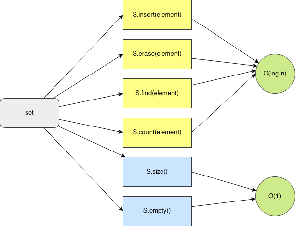

```{r setup, include=FALSE}
htmltools::tagList(rmarkdown::html_dependency_font_awesome())
```

> "Don't reinvent the wheel!"


<div class="topic">Standard Template Library (STL) </div>

STL is a collection of libraries of C++ that we can use in the contests. It
gives us common data structures (array, stack, set, priority_queue, map, ...), 
common algorithms (sort, next_permutation, binary_search, lower_bound,
upper_bound), common functions (input-output (I/O), sqrt, pow, abs, min, max, ...)

First of all, lets understand what happens in a simple hello world program.

```c++
#include <bits/stdc++.h>

using namespace std;

int main () {
  cout << "Hello World!" << '\n';
  return 0;
}
```

(The explanation will be given in class)

Extra: You can also practice competitive programming in other languages.

Examples:

- [Petr](https://codeforces.com/submissions/Petr/page/3)

- [pajenegod](https://codeforces.com/submissions/pajenegod)

But, as mentioned in the first class, C++ is usually better for its efficiency
and simplicity.

<div class="topic">Numeric data types and its operations</div>

### Tipos de datos enteros
- `int` $[-2^{31}, 2^{31}) \approx [-10^9, 10^9]$
- `long long` $[-2^{63}, 2^{63}) \approx [-10^{18}, 10^{18}]$

### Tipos de datos flotantes
- float
- double
- long double

### Operaciones aritméticas
- addition: x + y
- subtraction: x - y
- multiplication: x * y (what happens if $x = y = 10^9$ and `x` and `y` are `int`)
- division: x / y (take care if `x`, `y` are `int` and you want the result in `float`)
- exponenciation: pow(x, y) (the output is in `double`)
- module: a % b (what happens if `b` is zero? why?)

### Order or precedence

$$int < long\ long < float < double < long\ double$$

Examples:

```c++
int x = 1;
long long y = 8;
auto z = x + y; // long long
```

```c++
int x = 1;
float y = 8;
auto z = x + y; // float
```

<div class="topic">String</div>

Another useful data type is `string`.

In [cplusplus.com](http://www.cplusplus.com/reference/string/string/) you will
find a reference of how to work with strings.

[Example](./code/class-03/string.cpp)

```c++
string s;
// input
cin >> s; // In the same way you can read a int, long long, float, ...
// You can iterate it in this way
for (int i = 0; i < s.size(); i++) {
  // s[i]: get the i-th element
  cout << s[i] << '\n'; // In the same way you can output a int, long long, float, ...
}
s[2] = 'b'; // modify the element in position 2
// You can also print the whole string
cout << s << '\n';
// Yout can also iterate in this way
for (char elem: s) {
  cout << elem;
}
cout << '\n'; // what happens without this line ?
s += 'a'; // you can add append a letter or string
cout << s.substr(2, 2) << '\n'; // what does this function do ?
// The comparisson is like this (take care of not using just one '=' )
if (s == "hola") cout << "ok" << '\n';
```

<div class="topic">Vector</div>

You will need a vector in almost all of your contests, so its very important to
know how to use it.

In [cplusplus.com](http://www.cplusplus.com/reference/vector/vector/) you will
find a reference of how to work with vectors.

[Example](./code/class-03/vector.cpp)

```c++
vector <int> arr;
// Add a element to the end of the vector - O(1)
arr.push_back(123);
arr.push_back(987);
arr.push_back(343);
arr.push_back(134);
arr.push_back(345);
// Delete the last element - O(1)
arr.pop_back();
// Insert a element in the i-th position - O(n)
int i = 2;
arr.insert(begin(arr) + i, 234);
// Delete a element in the i-th position - O(n)
i = 1;
arr.erase(begin(arr) + i);
// Copy the vector - O(n)
vector <int> arrCopy = arr;
// We can iterate a vector in this way
for (int arr_i: arr) {
  // do something
}
// We can also use 'auto'
for (auto elem: arr) {
  cout << elem << '\n';
}
// We can also iterate in this way
// arr.size() returns the number of element of the vector - O(1)
for (int i = 0; i < arr.size(); i++) {
  // arr[i]: get the i-th element - O(1)
  cout << arr[i] << '\n';
}
// Delete all the elements - O(n)
arr.clear();
```

You can find the more common methods of vectors and its complexity in this image.

<div class="row text-center">

</div>

A [deque](http://www.cplusplus.com/reference/deque/deque/) gives us all the
methods of a vector and two more:

- push_front: Insert a element in the begining O(1)

- pop_front: Erase the first element O(1)

Read what these functions do:

* [`min_element`](http://www.cplusplus.com/reference/algorithm/min_element/)
* [`sort`](http://www.cplusplus.com/reference/algorithm/sort/)
* [`fill`](http://www.cplusplus.com/reference/algorithm/fill/)
* [`reverse`](http://www.cplusplus.com/reference/algorithm/reverse/)
* [`random_shuffle`](http://www.cplusplus.com/reference/algorithm/random_shuffle/)
* [`unique`](http://www.cplusplus.com/reference/algorithm/unique/)
* [`count`](http://www.cplusplus.com/reference/algorithm/count/)

Question: How would you declare a matrix ?

<div class="topic">Set</div>
In [cplusplus.com](http://www.cplusplus.com/reference/set/set/) you will find
a reference of how to work with sets.

[Example](./code/class-03/set.cpp)

```c++
set <int> S;
// Insert a element - O(log n)
S.insert(3);
S.insert(4);
S.insert(-100);
S.insert(-345);
// The elements are stored in ascending order
for (auto x: S) {
  cout << x << endl;
}
// Check if a element is in the set - O(log n)
if (S.count(4) > 0) {
  cout << "4 is in S\n";
}
// You can also check that using the method find
if (S.find(4) != end(S)) {
  cout << "4 is in S" << endl;
}
// Delete a elemento - O(log n)
S.erase(4);
// You can also delete in this way
S.erase(S.find(-100));
// If we store the iterator - O(log n)
// auto it = S.find(val) - O(log n)
// Then we can erase the element - O(1)
// S.erase(it)
```

You can find the more common methods of sets and its complexity in this image.

<div class="row text-center">

</div>

Read about [multisets](http://www.cplusplus.com/reference/set/multiset/).

<div class="topic">Map</div>

In [cplusplus.com](http://www.cplusplus.com/reference/map/map/) you will find
a reference of how to work with maps.

[Example](./code/class-03/map.cpp)

```c++
map <string, int> my_map;
// Insert a element - O(log n)
my_map["hola"] = 1;
my_map["mundo"] = 5;
// The elements are stored in ascending order
for (auto x: my_map) {
  cout << x.first << ' ' << x.second << endl;
}
// Check if a element is in the map - O(log n)
if (my_map.count("hola") > 0) {
  cout << "4 is in my_map\n";
}
// You can also check that using the method find
if (my_map.find("hola") != end(my_map)) {
  cout << "4 is in my_map" << endl;
}
my_map["hola"] = 10;
for (auto x: my_map) {
  cout << x.first << ' ' << x.second << '\n';
}
// Delete a elemento - O(log n)
my_map.erase("hola");
// You can also delete in this way
my_map.erase(my_map.find("mundo"));
// If we store the iterator - O(log n)
// auto it = my_map.find(val) - O(log n)
// Then we can erase the element - O(1)
// my_map.erase(it)
```

The complexity of its operations is the same of a set.

<div class="topic">Struct</div>

With a `struct` we can create our own data type which can encapsulate other
data type.

[Example](./code/class-03/struct.cpp)

```c++
#include <bits/stdc++.h>

using namespace std;

struct MyStructure {
  // we can declare attributes of different types
  int var1;
  double var2;
  string var3;
  MyStructure (int var1, double var2, string _var3):
    var1(var1),
    var2(var2) { // we can initialize the variables in this way
      var3 = _var3; // ot in this way
    }
  void my_method () {
    cout << var1 << ' ' << var2 << ' ' << var3 << '\n';
  }
};

int main () {
  MyStructure structure(18, 20.7, "hello world!");
  structure.my_method(); // cal a method
  structure.var1 = 19; // access an attribute
  cout << structure.var3 << '\n';
  return (0);
}
```

Read about [pair](http://www.cplusplus.com/reference/utility/pair/).

Read  [Antti  Laaksonen.Competitive  programmer’s  handbook - chapter
1 y 4](https://jadi.net/wp-content/uploads/2017/07/competetive-programmers-handbook.pdf). Section 1.4 will help you understand common practice that you will find in competitive programming (which you eventually will use) and in Chapter 4 you will see more examples of how yo use `vector`, `set`, `map` and much more.

You may also be interested in reading:

- [Competitive C++ Manifesto: A Style Guide](https://codeforces.com/blog/entry/64218)

- [TopCoder - Power up C++ with the Standard Template Library - Part
  I](https://www.topcoder.com/community/competitive-programming/tutorials/power-up-c-with-the-standard-template-library-part-1/)

<div class="topic" id="contest">Contest</div>

You can find the contest [here](https://vjudge.net/contest/351569).


<!-- Begins problem A -->
<div class="card">
<div class="collapsed solution-title" type="button" data-toggle="collapse" data-target="#collapseProblemA" aria-expanded="false" aria-controls="collapseTwo">
<!-- title -->
  <i class="fas fa-caret-right"></i> <p class="title">A: Chat Server's Outgoing Traffic</p>
</div>
<!-- begin body -->
<div id="collapseProblemA" class="collapse">
<div class="card-body solution-body">

### <a href="https://codeforces.com/contest/5/problem/A" target="_blank">Problem A: Chat Server's Outgoing Traffic</a>

Just implement what the problem says.

  <!-- begin code -->
  <div class="collapsed code-title" type="button" data-toggle="collapse" data-target="#codeProblemA" aria-expanded="false" aria-controls="collapseTwo">
  <!-- title -->
  <i class="fas fa-caret-right"></i> <p class="title">Code</p>
  </div>
  <div id="codeProblemA" class="collapse">
  
```c++
#include <bits/stdc++.h>

#define all(A) begin(A), end(A)
#define rall(A) rbegin(A), rend(A)
#define sz(A) int(A.size())
#define pb push_back
#define mp make_pair

using namespace std;

typedef long long ll;
typedef pair <int, int> pii;

int main () {
  ios::sync_with_stdio(false); cin.tie(0);
  int ans = 0;
  int cur = 0;
  string s;
  while (getline(cin, s)) {
    if (s[0] == '+') {
      cur++;
    } else if (s[0] == '-') {
      cur--;
    } else {
      int pos = 0;
      while (s[pos] != ':') pos++;
      ans += (sz(s) - pos - 1) * cur;
    }
  }
  cout << ans << '\n';
  return (0);
}
```
  </div>
  <!-- ends code -->


</div>
</div>
</div>
<!-- ends problem A -->


<!-- Begins problem B -->
<div class="card">
<div class="collapsed solution-title" type="button" data-toggle="collapse" data-target="#collapseProblemB" aria-expanded="false" aria-controls="collapseTwo">
<!-- title -->
  <i class="fas fa-caret-right"></i> <p class="title">B: Counting-out Rhyme</p>
</div>
<!-- begin body -->
<div id="collapseProblemB" class="collapse">
<div class="card-body solution-body">

### <a href="https://codeforces.com/problemset/problem/792/B" target="_blank">Problem B: Counting-out Rhyme</a>

The constraints are small, just simulate what the problem says.

  <!-- begin code -->
  <div class="collapsed code-title" type="button" data-toggle="collapse" data-target="#codeProblemB" aria-expanded="false" aria-controls="collapseTwo">
  <!-- title -->
  <i class="fas fa-caret-right"></i> <p class="title">Code</p>
  </div>
  <div id="codeProblemB" class="collapse">
  
```c++
#include <bits/stdc++.h>

#define all(A) begin(A), end(A)
#define rall(A) rbegin(A), rend(A)
#define sz(A) int(A.size())
#define pb push_back
#define mp make_pair

using namespace std;

typedef long long ll;
typedef pair <int, int> pii;

int main () {
  ios::sync_with_stdio(false); cin.tie(0);
  int n, k;
  cin >> n >> k;
  vector <int> arr(n);
  iota(all(arr), 1);
  int cur = 0;
  for (int i = 0; i < k; i++) {
    int a;
    cin >> a;
    a %= sz(arr);
    while (a--) cur = (cur + 1) % sz(arr);
    cout << arr[cur] << ' ';
    arr.erase(begin(arr) + cur);
    cur %= sz(arr);
  }
  return (0);
}
```
  </div>
  <!-- ends code -->


</div>
</div>
</div>
<!-- ends problem B -->


<!-- Begins problem C -->
<div class="card">
<div class="collapsed solution-title" type="button" data-toggle="collapse" data-target="#collapseProblemC" aria-expanded="false" aria-controls="collapseTwo">
<!-- title -->
  <i class="fas fa-caret-right"></i> <p class="title">C: Shuffle Hashing</p>
</div>
<!-- begin body -->
<div id="collapseProblemC" class="collapse">
<div class="card-body solution-body">

### <a href="https://codeforces.com/problemset/problem/1278/A" target="_blank">Problem C: Shuffle Hashing</a>


If you can construct `h` from `p`, then $\exists s_1, s_2, q \mid h = s_1 + q + s_2$

Then $h[n:n + m] = q$ where `n` is the length $s_1$ and `m` the length of`p`.
Then $sort(h[n:n + m]) = sort(p)$.
So, we just need to check if that is true for some value of $n$.

  <!-- begin code -->
  <div class="collapsed code-title" type="button" data-toggle="collapse" data-target="#codeProblemC" aria-expanded="false" aria-controls="collapseTwo">
  <!-- title -->
  <i class="fas fa-caret-right"></i> <p class="title">Code</p>
  </div>
  <div id="codeProblemC" class="collapse">
  
```c++
#include <bits/stdc++.h>

#define all(A) begin(A), end(A)
#define rall(A) rbegin(A), rend(A)
#define sz(A) int(A.size())
#define pb push_back
#define mp make_pair

using namespace std;

typedef long long ll;
typedef pair <int, int> pii;

int main () {
  ios::sync_with_stdio(false); cin.tie(0);
  int tc;
  cin >> tc;
  while (tc--) {
    string p, h;
    cin >> p >> h;
    bool ok = false;
    sort(all(p));
    for (int i = 0; i < sz(h); i++) {
      string x = h.substr(i, sz(p));
      sort(all(x));
      if (x == p) ok = true;
    }
    if (ok) cout << "YES\n";
    else cout << "NO\n";
  }
  return (0);
}
```
  </div>
  <!-- ends code -->


</div>
</div>
</div>
<!-- ends problem C -->


<!-- Begins problem D -->
<div class="card">
<div class="collapsed solution-title" type="button" data-toggle="collapse" data-target="#collapseProblemD" aria-expanded="false" aria-controls="collapseTwo">
<!-- title -->
  <i class="fas fa-caret-right"></i> <p class="title">D: Free spots</p>
</div>
<!-- begin body -->
<div id="collapseProblemD" class="collapse">
<div class="card-body solution-body">

### <a href="https://onlinejudge.org/index.php?option=com_onlinejudge&Itemid=8&page=show_problem&problem=1644" target="_blank">Problem D: Free spots</a>


For each test we can create a matrix of booleans initialized of false's. Then,
for each query $x_1, y_1, x_2, y_3$ we set to true every element of the matrix in
position $(r, c) \mid x_1 \leq r \leq x_2 \land y_1 \leq c \leq y_2$, assumming $x_1
\leq x_2 \land y_1 \leq y_2$. So, after processing every query, the answer is
the number of elements that are false.

  <!-- begin code -->
  <div class="collapsed code-title" type="button" data-toggle="collapse" data-target="#codeProblemD" aria-expanded="false" aria-controls="collapseTwo">
  <!-- title -->
  <i class="fas fa-caret-right"></i> <p class="title">Code</p>
  </div>
  <div id="codeProblemD" class="collapse">
  
```c++
#include <bits/stdc++.h>

#define all(A) begin(A), end(A)
#define rall(A) rbegin(A), rend(A)
#define sz(A) int(A.size())
#define pb push_back
#define mp make_pair

using namespace std;

typedef long long ll;
typedef pair <int, int> pii;

int main () {
  ios::sync_with_stdio(false); cin.tie(0);
  int w, h, n;
  while (cin >> w >> h >> n) {
    if (w == 0 and h == 0 and n == 0) break;
    vector <vector <bool>> vis(w + 1, vector <bool> (h + 1, false));
    while (n--) {
      int x1, y1, x2, y2;
      cin >> x1 >> y1 >> x2 >> y2;
      for (int r = min(x1, x2); r <= max(x1, x2); r++) {
        for (int c = min(y1, y2); c <= max(y1, y2); c++) {
          vis[r][c] = true;
        }
      }
    }
    int cnt = 0;
    for (int r = 1; r <= w; r++) {
      for (int c = 1; c <= h; c++) {
        if (!vis[r][c]) cnt++;
      }
    }
    if (cnt == 0) cout << "There is no empty spots.\n";
    else if (cnt == 1) cout << "There is one empty spot." << '\n';
    else cout << "There are " << cnt << " empty spots.\n";
  }
  return (0);
}
```
  </div>
  <!-- ends code -->


</div>
</div>
</div>
<!-- ends problem D -->

<p style="float: none; clear: both;"></p>

<div style="float: right;" class="pt-3">	
  <a class="continue-link" href="./class-04.html" 
     data-toggle="tooltip" title="Complete Search I">
  Next
  </a>
</div>

<div class="pt-3">
  <a class="continue-link" href="./class-02.html"
     data-toggle="tooltip" title="Asymptotic Analysis">
  Previous
  </a>
</div>

<script>
  $('#all-classes').collapse('show');
  $('#class-03').addClass('active');
  const cur_class = document.getElementById('class-03');
  cur_class.scrollIntoView({
    behavior: 'smooth',
    block: 'center'
  });
</script>
