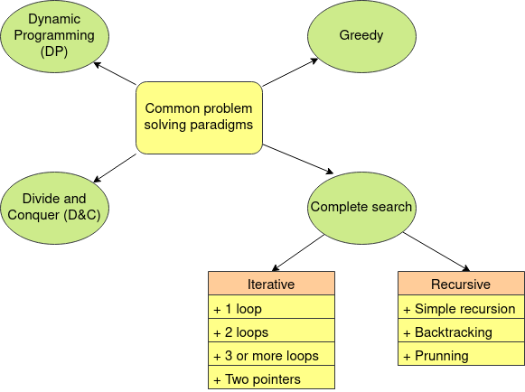

```{r setup, include=FALSE}
htmltools::tagList(rmarkdown::html_dependency_font_awesome())
```

> "Union make Force"


<div class="topic">Problem Solving Paradigms </div>


A programming paradigm is a way to solve problems. The four problem solving
paradigms commonly used in programming contests are:

<div class="center-image">

</div>

Complete search is a general method that can be used to solve almost any
algorithm problem. It basically try to generate all possible solutions to
a problem in order to do something with them (count number of elements, find
a particular solution with one property, etc).

You can find complete search solution in two ways: iterative and recursive.
When it is iterative it may be a single loop, two loops, three or more loops,
using two pointers, etc. When it is recursive it can be a simple recursive
function, it can be a recursive function that search different states with
trial and error (backtracking), it may have some kind of prunning in order to
not visit every state, etc.

When solving complete search solutions you will follow some combination of
these structures to solve problems.

When you find complete search in a iterative way it is called a `brute
force` solution. In the next 4 classes we will study more about this kind of
solutions. Moreover, mastering this paradigm will help you to understand easily the other
ones.

<div class="topic">Pythagorean triples</div>

Lets start this paradigm solving a simple problem.

A pythagorean triple is a triplet (x,y,z) that satisfies the equation $x^2 + y^2 = z^2$.

**Problem:** You will receive an integer $n$. Find the number of pythagorean triples such that $1 \leq x, y, z \leq n$.

$$1 \leq n \leq 10^3$$


### First solution
We can fix $x, y, z$ using three loops and verify if the equation holds in $O(n^3)$.

```c++
int solution1 (int n) {
  int cnt = 0;
  for (int x = 1; x <= n; x++) {
    for (int y = 1; y <= n; y++) {
      for (int z = 1; z <= n; z++) {
        if (x * x + y * y == z * z) {
          cnt++;
        }
      }
    }
  }
  return cnt;
}
```

We can fix $x, y$ and determine if $\exists \, 1 \leq z \leq n$ that holds the
equation in $O(n^2)$.

### Second solution
```c++
int solution2 (int n) {
  vector <bool> is_sq(n * n + 1, false);
  for (int z = 1; z <= n; z++) {
    is_sq[z * z] = true;
  }
  int cnt = 0;
  for (int x = 1; x <= n; x++) {
    for (int y = 1; y <= n; y++) {
      if (x * x + y * y <= n * n and is_sq[x * x + y * y]) {
        cnt++;
      }
    }
  }
  return cnt;
}
```

### Third solution

If $(x, y, z)$ is a pythagorean triple, then $(kx, ky, kz), k \in \mathbb{N}$ is also a pythagorean triple.

So, if we find $(x, y, z) \mid gcd(x, y, z) = 1$, then the number of triples
$(kx, ky, kz) \mid 1 \leq kx, ky, kz \leq n$ is $\min(\lfloor n / x \rfloor, \lfloor n / y \rfloor, \lfloor n / z \rfloor )$.

If $(x, y, z)$ is a pythagorean triple and $gcd(x, y, z) = 1$, then $(x, y, z)$
is called a primite pythagorean triple.

And there is a property (Euclid's formula) that says that every primite
pythagorean triple can be represented by a pair $(a, b) \mid 0 < b < a \land
gcd(a, b) = 1 \land a$ and $b$ are not both odds in the following way:

$$x = a^2 - b^2$$
$$y = 2 * a * b$$
$$z = a * a + b * b$$

Then we can generate primites $(x, y, z) \land (y, x, z)$ and count how many of
their multiples hold the condition of the problem in $O(n^2 \log n)$.

**Note:**

$gcd(a, b) =$ greatest common divisor of $a$ and $b = \max(d \mid d | a \land d | b)$ 

```c++
int solution3 (int n) {
  int cnt = 0;
  for (int a = 1; a < n / 2; a++) {
    for (int b = 1; b < a; b++) {
      if (__gcd(a, b) != 1) continue;
      if (a % 2 and b % 2) continue;
      int x = a * a - b * b;
      int y = 2 * a * b;
      int z = a * a + b * b;
      int add = min({n / x, n / y, n / z});
      cnt += 2 * add;
    }
  }
  return cnt;
}
```

[Full code](./code/class-04/pythagorean-triple.cpp)

<div class="topic">Primality Test</div>

**Problem:** Given a number $n$, determine if it is prime or not,

**Definition:** A prime number is a natural number that have exactly two divisors. The first prime numbers are $2, 3, 5, 7, 11, 13, \dots$

#### First solution

We can use the given definition and implement a $O(n)$ solution.

```c++
bool isPrime1 (int n) {
  int n_div = 0;
  for (int d = 1; d <= n; d++) {
    if (n % d == 0) n_div++;
  }
  return (n_div == 2);
}
```


#### Second solution
We notice that if $d | n \to (n / d) | n$. Moreover: 
$$\text{If } d \not = \sqrt{n} \to (d < \sqrt{n} < (n / d)) \lor ((n / d) < \sqrt{n} < d)$$

So we can assume $d < (n / d)$ iterate for every $d < \sqrt{n}$ and if $d | n$
count two more divisors ($d, n / d$) and handle the special case $d
= \sqrt{n}$. In this way we can count the number of divisors of $n$ and check if a number if prime in $O(\sqrt{n})$.

```c++
bool isPrime2 (int n) {
  int n_div = 0;
  for (int d = 1; d * d <= n; d++) {
    if (n % d == 0) {
      n_div++;
      if (n / d != d) n_div++;
    }
  }
  return (n_div == 2);
}
```

[Full code](./code/class-04/primality-check.cpp)

<div class="topic">Sieve of Eratosthenes</div>

<div class=topic><a href="">Contest</a></div>
