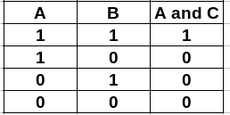
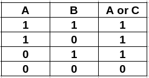
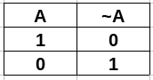

```{r setup, include=FALSE}
htmltools::tagList(rmarkdown::html_dependency_font_awesome())
```

> "Turning out the mask"

<div class="topic">Contribution technique</div>

This technique can help to reduce long computations with lot of variables. This
kind of problems are usually of couting and combinatorics.

**Problem:** You will receive $n$ points on the plane. Find how many
non-degenerate triangles you can build with these points as vertices.

$$1 \leq n \leq 2000$$

First, we note that we can implement a $O(n^3)$ solution, but we need something
better. Then, we remember that if we have three no collinear points, we have
a triangule. Moreover, two different points form a line. Using these ideas, we
can fix a point and a line that pass throught it. If we fix the point 'A' of
a triangle, the second vertex 'B' can be any other point that pass thought this
line. If $x$ points pass on this line, then $n - x$ points are outside, so 'C' has $n - x$ options. So, if we fix a point and a line that pass though it we know that this line adds $(x - 1) \cdot (n -x)$  to the answer. Then, we can use brute force over it. Nevertheless, we are doing double couting (each point is counted 3 times and in two directions). So, the answer is divided by 6.

Moreover, we would like, for example, to work with the vectors $\{ (a, b), (2
\cdot a, 2 \cdot b), (-a, -b), \dots \}$ as if they were an unique vector. For
this reason we can use its direction vector, but we need to work with integers.
Check the implementation for more details.

Using these ideas we can implement a $O(n^2 \log n)$ solution.

```c++
#include <bits/stdc++.h>

map<pair<int, int>, int> tri[maxN];

int main() {
  cin >> n;
  for (int i = 1; i <= n; ++i) {
    cin >> x[i] >> y[i];
  }
  for (int i = 1; i <= n; ++i) {
    for (int j = 1; j <= n; ++j) {
      if (i == j) {
        continue;
      }
      int vx = x[i] - x[j];
      int vy = y[i] - y[j];
      int g = __gcd(abs(vx), abs(vy));
      vx /= g;
      vy /= g;
      if (vx < 0 or vx == 0 and vy < 0) {
        vx = -vx;
        vy = -vy;
      }
      tri[i][{vx, vy}] += 1;
    }
  }
  long long ans = 0;
  for (int i = 1; i <= n; ++i) {
    for (auto v: tri[i]) {
      ans += (n - 1 - v.second) * v.second; 
    }
  }
  cout << ans / 6 << endl;
  return 0;
}
```

<div class="topic">Seaching over all the permutations</div>

There are problems where you need to search over all the permutations of $[1, 2, \dots, n]$ in order to find a solution. You can do it using the STL. For example:

```c++
#include <bits/stdc++.h>

using namespace std;

int main () {
  int n = 4;
  vector <int> arr(n);
  iota(begin(arr), end(arr), 1);
  // the array must be sorted or you won't get all the permutations
  do {
    for (int arr_i: arr) {
      cout << arr_i << ' ';
    }
    cout << '\n';
  } while (next_permutation(begin(arr), end(arr)));
  return (0);
}
```
The above code has complexity $O(n! n)$.

Now, let's see this technique in [this problem](https://codeforces.com/problemset/problem/910/C).

**Solution:**

Note that $abcdefghij$ can be mapped to $0123456789$. Then, we can search the
answer in $O(\Sigma! n)$ where $\Sigma = 10$. But $1 \leq n \leq 1000$, so this
approach would be a $TLE$ veredict. Nevertheless, we can use a counter of
frecuencies for each digit and then get the total sum using it. In this way we
have an $O(\Sigma! LS)$  solution, where $S = 10 \land L \leq 6$. Here $L$ is the
maximum number of digits.

```c++
#include <bits/stdc++.h>

using namespace std;

const int LEN = 6, SIGMA = 10;

int cnt[LEN + 1][SIGMA + 1], val[SIGMA + 1];
bool invalid[SIGMA + 1];

int main () {
  int n;
  cin >> n;
  for (int i = 0; i < n; i++) {
    string number;
    cin >> number;
    invalid[number[0] - 'a'] = true;
    int sz = number.size();
    for (int j = 0; j < sz; j++) {
      cnt[LEN - sz + j][number[j] - 'a']++;
    }
  }
  string sigma = "abcdefghij";
  int ans = INT_MAX;
  do {
    if (invalid[sigma[0] - 'a']) continue;
    int p = 0;
    for (const char ch: sigma) val[ch - 'a'] = p++;
    int sum = 0, carry = 0, power = 1;
    for (int i = LEN - 1; i >= 0; i--) {
      int ac = 0;
      for (int j = 0; j < SIGMA; j++) {
        ac += cnt[i][j] * val[j];
      }
      ac += carry;
      sum = sum + power * (ac % 10);
      power *= 10;
      carry = ac / 10;
    }
    while (carry) {
      sum = sum + power * (carry % 10);
      power *= 10;
      carry /= 10;
    }
    ans = min(ans, sum);
  } while (next_permutation(begin(sigma), end(sigma)));
  cout << ans << endl;
  return (0);
}
```

<div class="topic">Binary representation</div>

In computer, numbers are represented as bit strings and remember that the bit representation of a number has this form:

  $X = \overline{b_kb_{k - 1} \dots b_0}_{(2)} = b_k \cdot 2^k + b_{k - 1} \cdot 2^{k - 1} + \dots + b_0 \cdot 2^0$

In C++, the `int` and `long long` type uses 32 and 64 bits, respectively.

For example, the number 42 is

$42 = \overline{00000000000000000000000000101010}_{(2)}$

The leftmost bit, the most significant bit, is the sign of the number. It is
0 for nonnegative numbers and 1 for negative number. The remaining 31 or 63 bits
are used for the magnitude of the number. For this reason we have:

* `int` can store numbers in $[-2^{31}, 2^{31})$
* `long long` can store numbers in $[-2^{63}, 2^{63})$

This number are store using what is called two's complement. This technique
alose 
allows us to represent negative numbers using this formula:

$$x < 0: value(x) = inv(-x - 1) = inv(-x) + 1$$

For example, to find the representation of -42 first invert all the bits.

$inv(42) = \overline{11111111111111111111111111010101}_{(2)}$

Then, increase it by one and we have:

$-42 = \overline{11111111111111111111111111010110}_{(2)}$

Moreover, unsigned types uses all the bits to store the value of a number, then
we have:

* `unsigned int` can store numbers in $[0, 2^{32})$
* `unsigned long long` can store numbers in $[0, 2^{64})$

You may also be interested in looking at what happend with Python's integers.
Check [this Link](https://mortada.net/can-integer-operations-overflow-in-python.html).

<div class="topic">Bitwise operations</div>

First, we need to recall these operators:

* AND (in C++ is `&` or `bitand`)

<div class="rows text-center">

</div>

* OR (in C++ is `|` OR `bitor`)

<div class="rows text-center">

</div>

* XOR (in C++ is `^`)

<div class="rows text-center">

</div>

* NOT (in C++ is `~`)

<div class="rows text-center">

</div>

In C++ we can see a number as a mask of bits, then when applying any of these
operators to a number, it is applied to every bit. For example:

```c++
int a = 7;      // 00000000000000000000000000000111
int b = 33;     // 00000000000000000000000000100001
int r1 = a & b; // 00000000000000000000000000000001
int r2 = a | b; // 00000000000000000000000000100111
int r3 = a ^ b; // 00000000000000000000000000100110
int r3 = ~a;    // 11111111111111111111111111111000
int r4 = ~b;    // 11111111111111111111111111011110
```

And, we can even shift the bits to the left or to the right using these
operators:

* Left shift (in C++ is `<<`)
  - `a << k` moves the bits of the mask of bits of `a` k positions to the
    left and insert `0`s to the right

* Left shift (in C++ is `>>`)
  - `a >> k` moves the bits of the mask of bits of `a` k positions to the
    right and insert `0`s to the left

For example:

```c++
int b = 33;      // 00000000000000000000000000100001
int x1 = b << 0; // 00000000000000000000000000100001
int x2 = b << 1; // 00000000000000000000000001000010
int x3 = b << 2; // 00000000000000000000000010000100
int x4 = b << 3; // 00000000000000000000000100001000
int y1 = b >> 0; // 00000000000000000000000000100001
int y1 = b >> 1; // 00000000000000000000000000010000
int y1 = b >> 2; // 00000000000000000000000000001000
int y1 = b >> 3; // 00000000000000000000000000000100
```

Moreover, you may notice that:

* $b << k = b \cdot 2^k$
* $b >> k = b / 2^k$

Then, particularly, we have that $1 << k = 2^k$ and we can combine all these
operator to manipulate bits. For example:

* Get the $k$-th bit of $a$:

```c++
int b_k = (a >> k) & 1;
```

* Turn on the $k$-th bit of $a$:

```c++
int k_on_a = a | (1 << k);
```

* Turn off the $k$-th bit of $a$:

```c++
int k_off_a = a & (~(1 << k));
```

* Toggle the $k$-th bit of $a$:

```c++
int k_toggle_a = a ^ (1 << k);
```

Moreover, there are some useful built functions of GCC that we can use in
competitive programming, for example:

```c++
int x = 12;
int r1 = __builtin_popcount(x);
// 2 - the number of 1s in the number
int r2 = __builtin_clz(x);
// 28 - the number of zeros at the beginning
int r3 = __builtin_ctz(x);
// 2 - the number of zeros at the end
```

You may be interested in checking the full list of [builtin funcionts of GCC](https://gcc.gnu.org/onlinedocs/gcc/Other-Builtins.html).

<div class="topic">Brute force on bitmasks</div>

There are some kind of problem where you have $n$ items and each item can be taken or not. Then, you can represent the states of the problems as $S = \{ b_1b_2b_3 \dots b_n: b_i = 0 \lor b_i = 1\}$. That is, if $b_i = 0$ we are not taken the $i-th$ element, else we are taking it. And we can use bitmasks to simulate $S$.

Let's see how to use it in [this problem](https://acm.timus.ru/problem.aspx?space=1&num=1060).

If you select the same cell two times, the field is not changed. Then, we only
care if each element is taken or not. Then we can simulate all the options in
$O(n^2 2^n)$ where $n=16$ for this problem.

```c++
#include <bits/stdc++.h>

using namespace std;

int main () {
  int dr[] = {0, 1, 0, -1, 0};
  int dc[] = {0, 0, 1, 0, -1};
  vector <string> grid(4);
  vector <string> black(4, string(4, 'b'));
  vector <string> white(4, string(4, 'w'));
  for (int i = 0; i < 4; i++) cin >> grid[i];
  int ans = INT_MAX;
  for (int mask = 0; mask < (1 << 16); mask++) {
    vector <string> tmp = grid;
    int cnt = 0;
    for (int bit = 0; bit < 16; bit++) {
      if ((mask >> bit) & 1) {
        cnt++;
        int r = bit / 4;
        int c = bit % 4;
        for (int d = 0; d < 5; d++) {
          int nr = r + dr[d];
          int nc = c + dc[d];
          if (0 <= min(nr, nc) and max(nr, nc) < 4) {
            if (tmp[nr][nc] == 'b') tmp[nr][nc] = 'w';
            else tmp[nr][nc] = 'b';
          }
        }
      }
    }
    if (tmp == black or tmp == white) {
      ans = min(ans, cnt);
    }
  }
  if (ans == INT_MAX) puts("Impossible");
  else cout << ans << endl;
  return (0);
}
```

Recommended readings:

* Competitive Programming 3, section 2.1 and 2.2.
* [Competitive Programmer’s Handbook, chapter 10](https://jadi.net/wp-content/uploads/2017/07/competetive-programmers-handbook.pdf)
* [GPC-UNI Clase 4](https://nbviewer.jupyter.org/github/GPC-UNI/Programacion-Competitiva/blob/master/uni-no-fiis/clase-04/clase-04.ipynb)
* [GPC-UNI Clase 5](https://nbviewer.jupyter.org/github/GPC-UNI/Programacion-Competitiva/blob/master/uni-no-fiis/clase-05/clase-05.ipynb)
* [PCUNI-2019 Clase 7](https://nbviewer.jupyter.org/github/TISparta/pcuni-2019/blob/master/clase-07/clase-07.ipynb)
* [Principles of Algorithmic Problem Solving, chapter 7](https://www.csc.kth.se/~jsannemo/slask/main.pdf)

<div class="topic" id="contest">Contest</div>

You can find the contest [here](https://vjudge.net/contest/354002).


<!-- Begins problem A -->
<div class="card" id="A">
<div class="collapsed solution-title" type="button" data-toggle="collapse" data-target="#collapseProblemA" aria-expanded="false" aria-controls="collapseTwo">
<!-- title -->
  <i class="fas fa-caret-right"></i> <p class="title">A: Nice Garland</p>
</div>
<!-- begin body -->
<div id="collapseProblemA" class="collapse">
<div class="card-body solution-body">

### <a href="https://codeforces.com/problemset/problem/1108/C" target="_blank">Nice Garland</a>

If we fix the first three elements, we can know how all the sequence should be.
Then we can try to find the answer in all the permutations of the string "RGB".

  <!-- begin code -->
  <div class="collapsed code-title" type="button" data-toggle="collapse" data-target="#codeProblemA" aria-expanded="false" aria-controls="collapseTwo">
  <!-- title -->
  <i class="fas fa-caret-right"></i> <p class="title">Code</p>
  </div>
  <div id="codeProblemA" class="collapse">

```c++
#include <bits/stdc++.h>

using namespace std;

int main () {
  ios::sync_with_stdio(false);
  cin.tie(0);
  int n;
  cin >> n;
  string s;
  cin >> s;
  vector <char> p = {0, 1, 2};
  string X = "RGB";
  int mn = INT_MAX;
  string ans;
  do {
    int cnt = 0;
    for (int i = 0; i < 3 and i < s.size(); i++) {
      for (int j = i; j < s.size(); j += 3) {
        cnt += s[j] != X[p[i]];
      }
    }
    if (cnt < mn) {
      mn = cnt;
      string ret = "";
      for (int k = 0; k < s.size(); k++) {
        ret += X[p[k % 3]];
      }
      ans = ret;
    }
  } while (next_permutation(begin(p), end(p)));
  cout << mn << endl;
  cout << ans << endl;
  return (0);
}
```

  </div>
  <!-- ends code -->

</div>
</div>
</div>
<!-- ends problem A -->


<!-- Begins problem B -->
<div class="card" id="B">
<div class="collapsed solution-title" type="button" data-toggle="collapse" data-target="#collapseProblemB" aria-expanded="false" aria-controls="collapseTwo">
<!-- title -->
  <i class="fas fa-caret-right"></i> <p class="title">B: Petr and a Combination Lock</p>
</div>
<!-- begin body -->
<div id="collapseProblemB" class="collapse">
<div class="card-body solution-body">

### <a href="https://codeforces.com/problemset/problem/1097/B" target="_blank">Petr and a Combination Lock</a>

Each angle can be used to rotate in a clockwise or counterclockwise direction
(i.e each angle have two options), then we can use a mask with $n$ bits to
simulate all possible states.

  <!-- begin code -->
  <div class="collapsed code-title" type="button" data-toggle="collapse" data-target="#codeProblemB" aria-expanded="false" aria-controls="collapseTwo">
  <!-- title -->
  <i class="fas fa-caret-right"></i> <p class="title">Code</p>
  </div>
  <div id="codeProblemB" class="collapse">

```c++
#include <bits/stdc++.h>

using namespace std;

int n;
vector <int> angle;

bool check (int mask) {
  int cur = 0;
  for (int bit = 0; bit < n; bit++) {
    if ((mask >> bit) bitand 1) cur += angle[bit];
    else cur -= angle[bit];
  }
  return (cur % 360) == 0;
}

int main () {
  cin >> n;
  angle.resize(n);
  for (int i = 0; i < n; i++) cin >> angle[i];
  bool ok = false;
  for (int mask = 0; mask < (1 << n); mask++) ok |= check(mask);
  puts(ok ? "YES" : "NO");
  return (0);
}
```

  </div>
  <!-- ends code -->

</div>
</div>
</div>
<!-- ends problem B -->


<!-- Begins problem C -->
<div class="card" id="C">
<div class="collapsed solution-title" type="button" data-toggle="collapse" data-target="#collapseProblemC" aria-expanded="false" aria-controls="collapseTwo">
<!-- title -->
  <i class="fas fa-caret-right"></i> <p class="title">C: Splitting Numbers</p>
</div>
<!-- begin body -->
<div id="collapseProblemC" class="collapse">
<div class="card-body solution-body">

### <a href="https://onlinejudge.org/index.php?option=com_onlinejudge&Itemid=8&page=show_problem&problem=3084" target="_blank">Splitting Numbers</a>

Just simulate what the problem says.

  <!-- begin code -->
  <div class="collapsed code-title" type="button" data-toggle="collapse" data-target="#codeProblemC" aria-expanded="false" aria-controls="collapseTwo">
  <!-- title -->
  <i class="fas fa-caret-right"></i> <p class="title">Code</p>
  </div>
  <div id="codeProblemC" class="collapse">

```c++
#include <bits/stdc++.h>

using namespace std;

int main () {
  int num;
  while (cin >> num, num != 0) {
    int num1 = 0;
    int num2 = 0;
    int cnt = 0;
    for (int bit = 0; bit < 32; bit++) {
      if (not ((num >> bit) & 1)) continue;
      if (cnt & 1) num2 |= (1 << bit);
      else num1 |= (1 << bit);
      cnt++;
    }
    cout << num1 << ' ' << num2 << '\n';
  }
  return (0);
}
```

  </div>
  <!-- ends code -->

</div>
</div>
</div>
<!-- ends problem C -->


<!-- Begins problem D -->
<div class="card" id="D">
<div class="collapsed solution-title" type="button" data-toggle="collapse" data-target="#collapseProblemD" aria-expanded="false" aria-controls="collapseTwo">
<!-- title -->
  <i class="fas fa-caret-right"></i> <p class="title">D: Number of Parallelograms</p>
</div>
<!-- begin body -->
<div id="collapseProblemD" class="collapse">
<div class="card-body solution-body">

### <a href="https://codeforces.com/problemset/problem/660/D" target="_blank">Number of Parallelograms</a>

We can say that $\square ABCD$ is a parallelogram if and only if
$\overrightarrow{AB} = \overrightarrow{CD}$.
Then, you can store all the possible vectors that you can form with these points, now if there are $x$ vectors $\overrightarrow{AB}$, you can form $\binom{x}{2} / 4$ parallelograms.

  <!-- begin code -->
  <div class="collapsed code-title" type="button" data-toggle="collapse" data-target="#codeProblemD" aria-expanded="false" aria-controls="collapseTwo">
  <!-- title -->
  <i class="fas fa-caret-right"></i> <p class="title">Code</p>
  </div>
  <div id="codeProblemD" class="collapse">

```c++
#include <bits/stdc++.h>

#define all(A) begin(A), end(A)
#define rall(A) rbegin(A), rend(A)
#define sz(A) int(A.size())
#define pb push_back
#define mp make_pair

using namespace std;

typedef long long ll;
typedef pair <int, int> pii;

int main () {
  ios::sync_with_stdio(false); cin.tie(0);
  int n;
  cin >> n;
  map <pii, int> mp;
  vector <pii> p (n);
  for (int i = 0; i < n; i++) cin >> p[i].first >> p[i].second;
  for (int i = 0; i < n; i++) {
    for (int j = 0; j < n; j++) {
      if (i == j) continue;
      pii v;
      v.first = p[i].first - p[j].first;
      v.second = p[i].second - p[j].second;
      mp[v]++;
    }
  }
  ll ans = 0;
  for (auto pp: mp) ans += 1LL * pp.second * (pp.second - 1) / 2;
  cout << ans / 4 << '\n';
  return (0);
}
```

  </div>
  <!-- ends code -->

</div>
</div>
</div>
<!-- ends problem D -->


<p style="float: none; clear: both;"></p>

<div style="float: right;" class="pt-3">
  <a class="continue-link" href="./class-08.html" 
     data-toggle="tooltip" title="Complete Search V">
  Next
  </a>
</div>

<div class="pt-3">
  <a class="continue-link" href="./class-06.html"
     data-toggle="tooltip" title="Complete Search III">
  Previous
  </a>
</div>

<script>
  $('#all-classes').collapse('show');
  $('#class-07').addClass('active');
  const cur_class = document.getElementById('class-07');
  cur_class.scrollIntoView({
    behavior: 'smooth',
    block: 'center'
  });
</script>
