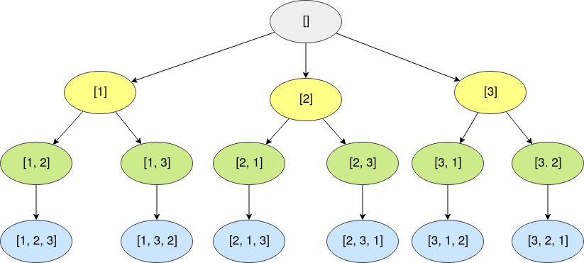
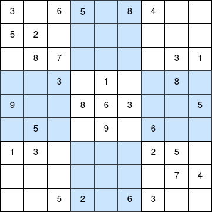

```{r setup, include=FALSE}
htmltools::tagList(rmarkdown::html_dependency_font_awesome())
```

> "Like the God of Go"

<div class="topic">Power set</div>

The power set of a set is the set of all its subsets. For example:

$$A = \{1, 2, 3\}$$
$$P(A) = \{\emptyset, \{1\},  \{2\},  \{3\},  \{1, 2\},  \{2, 3\},  \{1, 3\}, \{1, 2, 3\} \}$$

Here $P(A)$ represents the power set of the set $A$. Moreover, we have that $|P(A)| = 2^{|A|}$.

**Extra:** In some books, $P(A)$ is written as $2^{A}$ (e.g [Motousek
- Invitation to Discrete Mathematics](https://www.amazon.com/-/es/Jiri-Matousek/dp/0198570422)).

We already know how to generate the power set of $A = \{1, 2, 3, \dots, n\}$
using bitmasks.


  <!-- begin code -->
  <div class="collapsed code-title" type="button" data-toggle="collapse" data-target="#codeProblembitmask" aria-expanded="false" aria-controls="collapseTwo">
  <!-- title -->
  <i class="fas fa-caret-right"></i> <p class="title">Code</p>
  </div>
  <div id="codeProblembitmask" class="collapse">

```c++
#include <bits/stdc++.h>

using namespace std;

void print (const vector <int>& arr) {
  cout << "{";
  bool first = true;
  for (int elem: arr) {
    if (!first) {
      cout << ", ";
    }
    cout << elem;
    first = false;
  }
  cout << "}\n";
}

int main () {
  int n = 3;
  for (int mask = 0; mask < (1 << n); mask++) {
    vector <int> subset;
    for (int bit = 0; bit < n; bit++) {
      if ((mask >> bit) & 1) {
        subset.push_back(bit + 1);
      }
    }
    print(subset);
  }
  return (0);
}
```

  </div>
  <!-- ends code -->

But, we can also generate it using recursion, but before that, let's review
about passing arguments to a function in C++.

```c++
#include <bits/stdc++.h>
     
using namespace std;
     
// Here is passed a reference to 'arr' in O(1)
// You CAN read from 'arr', but you CAN NOT modify it
void f1 (const vector <int>& arr) {

}
     
// Here is passed a reference to 'arr' in O(1)
// You CAN read from 'arr' and you CAN modify it
void f2 (vector <int>& arr) {
}
     
// Here is passed a copy of 'arr' in O(n)
// You CAN read from 'arr' and you CAN modify it
// BUT, you are modifying a copy of 'arr', not the 'arr' of 'main'
void f3 (vector <int> arr) {
     
}
     
int main () {
  int n = 10000;
  vector <int> arr(n);
  for (int i = 0; i < n; i++) {
    arr[i] = i;
  }
  f1(arr);
  f2(arr);
  f3(arr);
  return (0);
}
```

If we want to generate the power set of $A = \{1, 2, 3\}$, we can make
a function that follows these states:

<div class="row text-center">

</div>

That is, if we are in the state $(a_1, a_2, \dots a_x) \mid a_1 < a_2 < \dots < 
a_x$, then we can go to $(a_1, a_2, \dots, a_x, a_y) \mid a_x < a_y \leq n$.

And we can implement it using recursion.


  <!-- begin code -->
  <div class="collapsed code-title" type="button" data-toggle="collapse" data-target="#codeProblembacktrack-power-set" aria-expanded="false" aria-controls="collapseTwo">
  <!-- title -->
  <i class="fas fa-caret-right"></i> <p class="title">Code</p>
  </div>
  <div id="codeProblembacktrack-power-set" class="collapse">

```c++
#include <bits/stdc++.h>

using namespace std;

void print (const vector <int>& arr) {
  cout << "{";
  bool first = true;
  for (int elem: arr) {
    if (!first) {
      cout << ", ";
    }
    cout << elem;
    first = false;
  }
  cout << "}\n";
}

void backtrack (vector <int>& arr, const int n) {
  print(arr);
  int ax = 0;
  if (!arr.empty()) {
    ax = arr.back();
  }
  for (int ay = ax + 1; ay <= n; ay++) {
    // add ay
    arr.push_back(ay);
    backtrack(arr, n);
    // delete ay
    arr.pop_back();
  }
}

int main () {
  int n = 3;
  vector <int> subset;
  backtrack(subset, n);
}
```

  </div>
  <!-- ends code -->

But, in competitive programming, we usually try to have as few parameters in
our functions as possible. Then, we realize that we can implement it in this
way (**why?**).


  <!-- begin code -->
  <div class="collapsed code-title" type="button" data-toggle="collapse" data-target="#codeProblembacktrack-power-set-global" aria-expanded="false" aria-controls="collapseTwo">
  <!-- title -->
  <i class="fas fa-caret-right"></i> <p class="title">Code</p>
  </div>
  <div id="codeProblembacktrack-power-set-global" class="collapse">

```c++
#include <bits/stdc++.h>

using namespace std;

void print (const vector <int>& arr) {
  cout << "{";
  bool first = true;
  for (int elem: arr) {
    if (!first) {
      cout << ", ";
    }
    cout << elem;
    first = false;
  }
  cout << "}\n";
}

// global variables
vector <int> subset;
int n;

void backtrack () {
  print(subset);
  int ax = 0;
  if (!subset.empty()) {
    ax = subset.back();
  }
  for (int ay = ax + 1; ay <= n; ay++) {
    // add ay
    subset.push_back(ay);
    backtrack();
    // delete ay
    subset.pop_back();
  }
}

int main () {
  n = 3;
  backtrack();
}
```

  </div>
  <!-- ends code -->

Here we have implemented a program to find the power set of $\{1, 2, 3, \dots, n\}$ in 
$O(n 2 ^ n)$. This is a solution using what is known as `backtracking`. In
general, a backtracking solution has this form:

```bw
let state be a global variable

T backtrack (some parameters):
  if (state is a terminal state):
    Do something with 'state' and return something
  
  for (state' reachable from state):
    # do something
    previous = state
    state = state'
    backtrack(some parameters')
    # reverse changes
    state = previous
```

A terminal state is a state in which we can not go to other states (or it is not
convenient to follow searching).

<div class="topic">0-1 Knapsack problem</div>

**Problem:** You have a knapsack of capacity $W$ (i.e you can put at most $W$ kg in this
knapsack). Moreover, you have $n$ items. Each item is describe as a pair
$(val_i, w_i)$, where $val_i$ is the cost of the item and $w_i$ the weight of
it. Find the maximum value you can store in this knapsack using the least
possible weight.

$$1 \leq n \leq 16$$

**Solution:**

Each item can be taken or not, then we can search over all the possibilites
(power set) using bitmasks or backtracking.


  <!-- begin code -->
  <div class="collapsed code-title" type="button" data-toggle="collapse" data-target="#codeProblem0-1-knapsack" aria-expanded="false" aria-controls="collapseTwo">
  <!-- title -->
  <i class="fas fa-caret-right"></i> <p class="title">Code</p>
  </div>
  <div id="codeProblem0-1-knapsack" class="collapse">

```c++
#include <bits/stdc++.h>

using namespace std;

int n;
int W;
vector <int> val;
vector <int> w;
vector <int> take;
int max_sum_val = 0;
int min_sum_w = 0;
vector <int> ans_items_taken;

void backtrack (int last_taken, int sum_val, int sum_w) {
  if (sum_w <= W and (sum_val > max_sum_val or
      (sum_val == max_sum_val and sum_w < min_sum_w))) {
    max_sum_val = sum_val;
    min_sum_w = sum_w;
    ans_items_taken = take;
  }
  for (int i = last_taken + 1; i < n; i++) {
    take.push_back(i);
    backtrack(i, sum_val + val[i], sum_w + w[i]);
    take.pop_back();
  }
}

int main () {
  n = 3;
  W = 10;
  // item 1
  val.push_back(10);
  w.push_back(10);
  // item 2
  val.push_back(1);
  w.push_back(8);
  // item 3
  val.push_back(13);
  w.push_back(2);
  backtrack(-1, 0, 0);

  cout << "Take items";
  for (int item: ans_items_taken) {
    cout << ' ' << item + 1;
  }
  cout << '\n';
  return (0);
}
```

  </div>
  <!-- ends code -->

<div class="topic">Permutations</div>

The problem of generating all the permutations can also be easily computed using
backtracking in $O(n n!)$


  <!-- begin code -->
  <div class="collapsed code-title" type="button" data-toggle="collapse" data-target="#codeProblempermutation" aria-expanded="false" aria-controls="collapseTwo">
  <!-- title -->
  <i class="fas fa-caret-right"></i> <p class="title">Code</p>
  </div>
  <div id="codeProblempermutation" class="collapse">

```c++
#include <bits/stdc++.h>

using namespace std;

int n;
vector <bool> used;
vector <int> permutation;

void print (const vector <int>& p) {
  for (int elem: p) {
    cout << elem << ' ';
  }
  cout << '\n';
}

void backtrack () {
  if (permutation.size() == n) {
    print(permutation);
    return;
  }
  for (int p_i = 1; p_i <= n; p_i++) {
    if (!used[p_i]) {
      used[p_i] = true;
      permutation.push_back(p_i);
      backtrack();
      used[p_i] = false;
      permutation.pop_back();
    }
  }
}

int main () {
  n = 3;
  used.resize(n + 1, false);
  backtrack();
  return (0);
}
```

  </div>
  <!-- ends code -->

Here we are following these states:

<div class="row text-center">

</div>

This image represents what is called the **recursion tree**. It show us how the
function do the transitions.

Moreover, notice that we do not need to do something like this:

```c++
.
.
.
  for (int p_i = 1; p_i <= n; p_i++) {
    if (!used[p_i]) {
      vector <bool> used_previous = used;
      vector <int> permutation_previous = permutation;
      used[p_i] = true;
      permutation.push_back(p_i);
      backtrack();
      used = used_previous;
      permutation = permutation_previous;
    }
  }
.
.
.
```

Because it will be heavier that the first solution and we know that:

* If previous of calling the recursion we ADD an element TO THE END of the vector, then
  after the recursion we must DELETE THE LAST element of the vector.
* If previous of calling the recursion we SET TO TRUE an element, then after
  the recursion we must SET TO FALSE that element.
* If previous of calling the recursion we ADD something, then after
  the recursion we must SUBTRACT something.
* Following this logic, If previous of calling the recursion we DO ONE OPERATION, then after
  the recursion we must REVERSE that operation. If the operation is complicated
  we can just save a copy of the previous state, else we can try to reverse the
  operations.

From all this one notice that if you are in your recursion in some `state` and
you go to `state'`, then after returning of traversing the recursion tree of
`state'` you expect to have some variables in the condition they were
before traversing the recursion tree of `state'`. Understanding this idea is
the key to implement backtracking solutions.

<div class="topic">Sudoku</div>

With backtracking it is easy to generate all possible movements in a game and
choose the best movement.

**Problem:**

<div class="row text-center">

</div>

Complete the above sudoku such that each number from 1 to 9 is found just once
in each row, column and quadrant.

**Solution:** We can just search all possible solutions using bactracking.

  <!-- begin code -->
  <div class="collapsed code-title" type="button" data-toggle="collapse" data-target="#codeProblemsudoku" aria-expanded="false" aria-controls="collapseTwo">
  <!-- title -->
  <i class="fas fa-caret-right"></i> <p class="title">Code</p>
  </div>
  <div id="codeProblemsudoku" class="collapse">

```c++
#include <bits/stdc++.h>

using namespace std;

vector <vector <int>> sudoku;
vector <vector <int>> sudoku_solved;
vector <vector <pair <int, int>>> quadrant;
int n;
int N;
bool found;

bool validInRow (int r, int d) {
  for (int c = 0; c < N; c++) {
    if (sudoku[r][c] == d) return false;
  }
  return true;
}

bool validInCol (int c, int d) {
  for (int r = 0; r < N; r++) {
    if (sudoku[r][c] == d) return false;
  }
  return true;
}

bool validInQuadrant (int q, int d) {
  for (pair <int, int> pos: quadrant[q]) {
    int r = pos.first;
    int c = pos.second;
    if (sudoku[r][c] == d) return false;
  }
  return true;
}

// run this function for every 0 <= r < N and 0 <= c < N and you will get
// what this function does
int getQuadrant (int r, int c) {
  return (r / n) * n + (c / n);
}

void backtrack (int r, int c) {
  if (r == N) {
    found = true;
    sudoku_solved = sudoku;
    return;
  }
  if (found) {
    return;
  }
  int nc = (c + 1 == N) ? 0 : c + 1; // new column
  int nr = (c + 1 == N) ? r + 1 : r; // new row
  if (sudoku[r][c] != 0) {
    backtrack(nr, nc);
    return;
  } 
  for (int d = 1; d <= 9; d++) {
    int quadrant = getQuadrant(r, c);
    if (validInRow(r, d) and
        validInCol(c, d) and
        validInQuadrant(getQuadrant(r, c), d)) {
      sudoku[r][c] = d;
      backtrack(nr, nc);
      sudoku[r][c] = 0;
    }
  }
}

void precomputation () {
  found = false;
  N = sudoku.size();
  n = 1;
  while ((n + 1) * (n + 1) <= N) n++;
  // n = sqrt(N)
  quadrant.resize(N);
  for (int r = 0; r < N; r++) {
    for (int c = 0; c < N; c++) {
      quadrant[getQuadrant(r, c)].push_back({r, c});
    }
  }
}

void print (const vector <vector <int>>& sudoku) {
  for (auto row: sudoku) {
    for (int elem: row) {
      cout << elem << ' ';
    }
    cout << '\n';
  }
}

int main () {
  sudoku = {
            {3, 0, 6, 5, 0, 8, 4, 0, 0},  
            {5, 2, 0, 0, 0, 0, 0, 0, 0},  
            {0, 8, 7, 0, 0, 0, 0, 3, 1},  
            {0, 0, 3, 0, 1, 0, 0, 8, 0},  
            {9, 0, 0, 8, 6, 3, 0, 0, 5},  
            {0, 5, 0, 0, 9, 0, 6, 0, 0},  
            {1, 3, 0, 0, 0, 0, 2, 5, 0},  
            {0, 0, 0, 0, 0, 0, 0, 7, 4},  
            {0, 0, 5, 2, 0, 6, 3, 0, 0}
           };
  precomputation();
  backtrack(0, 0);
  print(sudoku_solved);
  return (0);
}
```

  </div>
  <!-- ends code -->

With this code we get this solution:

<div class="row text-center">

</div>

<div class="topic">N-queen problem</div>

**[Problem:](https://www.hackerearth.com/practice/basic-programming/recursion/recursion-and-backtracking/tutorial/)** Given a chess board having $N \times N$ cells, you need to place $N$ queens on the board in such a way that no queen attacks any other queen. 

$$1 \leq N \leq 10$$

**Remember:** A queen can attack in a complete row, column or diagonal.

**Solution:** We could try to place N queen in the $N \times N$ cells. In this
way we may get $\binom{N \times N}{N}$ states to check. But for $N = 8$ we have
that $\binom{N \times N}{N} \approx 8B$, so we need a better approach.

We know that each queen should be in different columns (else they will be
attacking each other). So we can generate these $N^N$ possible configurations and check
if the conditions holds, but this solution may not be enough.

We know that each queen should be in different rows and columns. Then, the rows
of the queens of a valid configuration are a permutation. The same holds for
the columns. Thereby, we have $N!$ possible configurations to check. We can
implement this idea using backtracking in this way:


  <!-- begin code -->
  <div class="collapsed code-title" type="button" data-toggle="collapse" data-target="#codeProblemn-queen" aria-expanded="false" aria-controls="collapseTwo">
  <!-- title -->
  <i class="fas fa-caret-right"></i> <p class="title">Code</p>
  </div>
  <div id="codeProblemn-queen" class="collapse">

```c++
#include <bits/stdc++.h>

using namespace std;

int n;
vector <pair <int, int>> queen;
vector <pair <int, int>> solution;

bool valid (int r, int c) {
  for (auto pp: queen) {
    // if same row or same column or same diagonal
    if ((pp.first == r) or
        (pp.second == c) or
        (abs(r - pp.first) == abs(c - pp.second))) {
      return false;
    }
  }
  return true;
}

void backtrack (int r) {
  if (r == n) {
    solution = queen;
    return;
  }
  if (!solution.empty()) {
    return;
  }
  for (int c = 0; c < n; c++) {
    if (valid(r, c)) {
      queen.push_back({r, c});
      backtrack(r + 1);
      queen.pop_back();
    }
  }
}

int main () {
  cin >> n;
  backtrack(0);
  if (solution.empty()) {
    cout << "NO\n";
    return (0);
  }
  vector <vector <int>> board(n, vector <int> (n, 0));
  for (auto pp: solution) {
    board[pp.first][pp.second] = 1;
  }
  cout << "YES\n";
  for (int r = 0; r < n; r++) {
    for (int c = 0; c < n; c++) {
      cout << board[r][c] << " \n"[c == n - 1];
    }
  }
  return (0);
}
```

  </div>
  <!-- ends code -->

For $N = 4$ the recursion tree of our solution is like this:

<div class="row text-center img-border">


Image taken from [Jeff Erickson - Algorithms - Chapter 2: Backtracking](http://jeffe.cs.illinois.edu/teaching/algorithms/).
</div>

The complexity of the above solution comes from the equation:

$$T_n = n \cdot T_{n - 1} + O(n)$$
$$\to T_n = O(n!)$$

Then, our solution has complexity $O(n!)$.

Recommended readings:

* [HackerEarth - Recursion and Backtracking](https://www.hackerearth.com/practice/basic-programming/recursion/recursion-and-backtracking/tutorial/)
* Competitive Programming 3, section 3.2.2, 8.2.1 and 8.2.2.
* [GeekForGeeks - Backtracking Algorithms](https://www.geeksforgeeks.org/backtracking-algorithms/)

You may also be interested in watching this documental of AlphaGo. [Here](https://youtu.be/8tq1C8spV_g) is the trailer.

<div class="topic" id="contest">Contest</div>

You can find the contest [here](https://vjudge.net/contest/354334).

The solutions will be uploaded after the contest.

<p style="float: none; clear: both;"></p>

<div style="float: right;" class="pt-3">
  <a class="continue-link" href="./class-09.html" 
     data-toggle="tooltip" title="Contest I">
  Next
  </a>
</div>

<div class="pt-3">
  <a class="continue-link" href="./class-07.html"
     data-toggle="tooltip" title="Complete Search IV">
  Previous
  </a>
</div>

<script>
  $('#all-classes').collapse('show');
  $('#class-08').addClass('active');
  const cur_class = document.getElementById('class-08');
  cur_class.scrollIntoView({
    behavior: 'smooth',
    block: 'center'
  });
</script>
