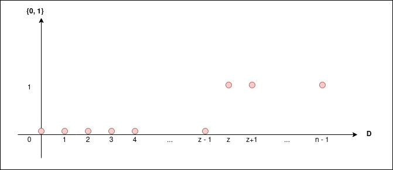
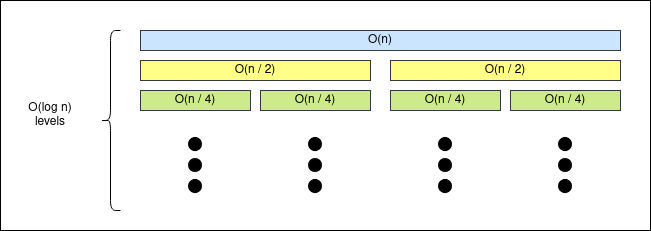
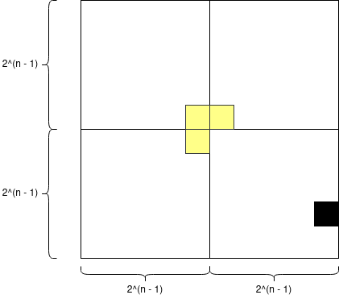

```{r setup, include=FALSE}
htmltools::tagList(rmarkdown::html_dependency_font_awesome())
```

> "Don’t repeat yourself"

<div class="topic">Generalized binary search</div>

When we are doing binary search we are basically finding a function $f: \mathbb{D} \to \{0, 1\}$. We are finding a function that maps the elements of a set $\mathbb{D}$ to $0$ or $1$ (can be seen as false or true respectively) and $f$ **is always a monotone** function (non-increasing or non-decreasing).

For example, if we have the array $A = \{b_0, b_1, b_2, \dots, b_{n - 1}\}$ and we
are going to do queries over the array to determine whether a number is in $A$
or not we can do these definitions:

$$\mathbb{D} = \{0, 1, 2, \dots, n\}$$
$$f_p(x) = [p \leq A[x]]$$

That is, $f = f_p$ will be a function that will indicate if $p \leq A[x]$ for
$x \in [0, n)$ and as $f$ must be monotone we need to sort $A$
(**why?**). Now, with these definitions and asumming $A$ is sorted, $f$ may
looks something like this.

<div class="row text-center">

</div>

Then, if $p$ is in the array $A$, it must hold that $A[z] = p$, so now our
problem is to find the first element where $f(x) = 1$ and we can
compute it using divide and conquer.

```c++
#include <bits/stdc++.h>

using namespace std;

// Returns true if p is in A in O(n)
bool brute_force (const vector <int>& A, int p) {
  for (int elem: A) {
    if (elem == p) return true;
  }
  return false;
}

// Returns true if p is in A in O(log n)
bool divide_and_conquer (const vector <int>& A, int p) {
  int l = 0, r = A.size() - 1;
  while (l != r) {
    int m = (l + r) >> 1; // = (l + r) / 2
    bool f_p = (p <= A[m]);
    if (f_p) {
      r = m;
    } else {
      l = m + 1;
    }
  }
  int z = l;
  return (A[z] == p);
}

int main () {
  // To get 'good' random numbers
  mt19937 rng(chrono::steady_clock::now().time_since_epoch().count());
  // Create A with n random values
  int n = 1000;
  int min_value = -1e6;
  int max_value = 1e6;
  vector <int> A(n);
  for (int& elem: A) {
    elem = uniform_int_distribution <int> (min_value, max_value)(rng);
  }
  sort(begin(A), end(A));
  // Check q queries
  int q = 1000;
  for (int i = 0; i < q; i++) {
    int p = uniform_int_distribution <int> (min_value, max_value)(rng);
    bool ret1 = brute_force(A, p);
    bool ret2 = divide_and_conquer(A, p);
    if (ret1 != ret2) {
      cout << "Something is wrong!\n";
      return (-1);
    }
  }
  cout << "OK!\n";
  return (0);
}
```

What would have changed if $f_p(x) = [A[x] \leq p]$ ?

The idea of defining the set $\mathbb{D}$ and the **mononote** function $f$
can be used in a great variety of problems. For example in [this problem](https://codeforces.com/contest/1201/problem/C).

Here let $median$ be the median of the original array, then we know that the
maximum median we can get must be in in $[median, median + k]$, so $\mathbb{D} = [median, median + k]$ and let $f$ be defined like this:


$f(x) = [$ can we obtain median x in at most k operations? $]$

Let $y$ be the position of the median, then if we have:

$$a_0, a_1, a_2, \dots, a_y, a_{y + 1}, \dots, a_{n - 1}$$

And we want $x$ as the new median in the minimum number of
operations, then we need to make $x \leq a_i, \forall \, y \leq i \leq n$. (**why?**). Moreover, there is a point $z$ such that:

$$f(i) = 1 \quad \forall i \in [median, z]$$
$$f(i) = 0 \quad \forall i \in [z + 1, median + 1]$$

So $f$ is monotone and our answer is $z$. The we can implement the following solution:

```c++
#include <bits/stdc++.h>

using namespace std;

typedef long long ll;

int main () {
  int n, k;
  cin >> n >> k;
  vector <int> a(n);
  for (int i = 0; i < n; i++) cin >> a[i];
  sort(begin(a), end(a));
  int y = n / 2;
  ll median = a[y];
  ll l = median, r = median + k;
  while (l != r) {
    ll m = (l + r + 1) / 2;
    ll n_operations = 0;
    for (int i = y; i < n; i++) {
      if (a[i] < m) {
        n_operations += m - a[i];
      }
    }
    if (l < 0) break;
    if (n_operations <= k) {
      l = m;
    } else {
      r = m - 1;
    }
  }
  int z = l;
  cout << z << '\n';
  return (0);
}
```

In these examples we have defined $\mathbb{D} \subset \mathbb{Z}$ but we may
have, for example, $\mathbb{D} \subset \mathbb{R}$.

Moreover, if you have problems determining how to compute $m$, always think of
what do you want to do when $l + 1 = r$. You want that $m = l \lor m = r$ and
then you will find if you need to compute $m = (l + r) / 2$ or $m = (l + r + 1) / 2$ and how to update $l, r$.

<div class="topic">Ternary search</div>

Let $f(x)$ be a unimodal function in $[l, r]$, that is, it holds

- The function stricly increases first, reaches a maximum (at a single point or over an interval) and then stricly decreases.

Or

- The function stricly decreases first, reaches a minimum (at a single point or over an interval) and then stricly increases.

Then, assuming the first scenario (the second one is analogous), how can we find the maximum value of $f(x) \mid x \in [l, r]$ ?

For simplicity, let $[l, r] \subset \mathbb{R}$.

Let $l \leq m_1 \leq m_2 \leq r$

Initially you know that the maximum is in $[l, r]$ and by the trichotomy
property there are three cases:

* $f(m_1) = f(m_2)$. Then we are done
* $f(m_1) < f(m_2)$. Then the answer must be in $[m_1, r]$ (**why?**).
* $f(m_1) > f(m_2)$. Then the answer must be in $[l, m_2]$ (**why?**).

So, each time we can reduce the interval where the answer must be. In we split
the interval $[l, r]$ in three parts, then we will find the answer in $O(\log n)$ and we may have:

$$m_1 = \frac{2 \cdot l + r}{3}$$
$$m_2 = \frac{l + 2 \cdot r}{3}$$

The idea also works when $[l, r] \subset \mathbb{Z}$ with some little modifications, but in these cases it is easier to use binary search because we just need to find the first $x$ where $f(x) \leq f(x + 1)$.

### Convex functions

We say that a real-valued function is convex if the line segment between any
two points on the graph of the function lies above or on the graph. More
formally, we have:

**Definition 1:** A set $X$ is convex if $\forall x_1, x_2 \in X, \forall t \in [0, 1]: t \cdot x_1 + (1 - t) \cdot x_2 \in X$.

**Definition 2:** Let $f: X \to \mathbb{R}$ be a function where $X$ is a convex
set, then $f$ is convex if $\forall x_1, x_2 \in X, \forall t \in [0, 1]: f(t \cdot x_1 + (1 - t) \cdot x_2) \leq t f(x_1) + (1 - t) \cdot f(x_2)$.

Moreover, we have some interesting properties. Let $f, g$ be convex functions, then we have:

* $f + g$ is convex
* $\max(f, g)$ is convex

Some examples of convex function are:

* $f(x) = |x|$
* $f(x) = x^2$
* $f(x) = e^x$

And what is interesting of convex functions is that we can apply ternary search
on them to find its minimum value.

### Examples

We can use ternary search to find the minimum of:

* $f(x) = |a_1 - x| + |a_2 - x| + \dots + |a_n - x|$
* $f(x) = (a_1 - x)^2 + (a_2 - x)^2 + \dots + (a_n - x)^2$


Now, try solving the problem at the end of [this tutorial](https://www.hackerearth.com/practice/algorithms/searching/ternary-search/tutorial/) to apply what we have learned.


So far we have study binary and ternary search, yet the D&C paradigm does not
reduce only to this. Next, we will show you two more scenarios where D&C paradigm
comes in handy.

<div class="topic">Merge sort</div>

### Subproblem: merge two sorted arrays

Let

$$a = [a_1, a_2, \dots, a_n]$$
$$b = [b_1, b_2, \dots, b_m]$$

be two sorted arrays. How can we get a sorted array with the elements of $a$ and $b$ ?

The most naive approach would be to create an array with its elements
and sort it, something like this:

```c++
vector <int> c;
for (int elem: a) c.push_back(elem);
for (int elem: b) c.push_back(elem);
sort(begin(c), end(c));
```

But, this solution is $O((n + m) \log (n + m))$ and we are not using the fact
that both arrays are sorted. But, we can notice that as both array are sorted,
the minimum element of $c$ must be $a_1$ or $b_1$. Next, out next minimum
element must be in $(a[2:n], b[1:m])$ or in $(a[1:n], b[2:m])$. That is, we can
iterate both arrays in such a way the we are always getting the next minimum
element of $c$, therefore we can get $c$ sorted in $O(n + m)$ in this way:

```c++
#include <bits/stdc++.h>

using namespace std;

// To get 'good' random numbers
mt19937 rng(chrono::steady_clock::now().time_since_epoch().count());
int min_value = -1e6;
int max_value = 1e6;

// return a random integer in [l, r]
int random (int l, int r) {
  return uniform_int_distribution <int> (l, r)(rng);
}

vector <int> get_random_array (int n) {
  vector <int> ret(n);
  for (int& elem: ret) {
    elem = random(min_value, max_value);
  }
  return ret;
}

vector <int> merge (const vector <int>& a, const vector <int>& b) {
  const int INF = INT_MAX;
  vector <int> A = a;
  vector <int> B = b;
  int n = A.size();
  int m = B.size();
  // to simplify the implementation
  A.push_back(INF);
  B.push_back(INF);
  int it1 = 0, it2 = 0;
  vector <int> c;
  while (it1 < n or it2 < m) {
    if (A[it1] <= B[it2]) {
      c.push_back(A[it1]);
      it1++;
    } else {
      c.push_back(B[it2]);
      it2++;
    }
  }
  return c;
}

int main () {
  for (int test = 0; test < 1000; test++) {
    int n = random(1, 1000);
    int m = random(1, 1000);
    vector <int> a = get_random_array(n);
    sort(begin(a), end(a));
    vector <int> b = get_random_array(m);
    sort(begin(b), end(b));
    // naive merge
    vector <int> c;
    for (int elem: a) c.push_back(elem);
    for (int elem: b) c.push_back(elem);
    sort(begin(c), end(c));
    if (c != merge(a, b)) {
      cout << "Something is wrong!\n";
      return (-1);
    }
  }
  cout << "OK!\n";
  return (0);
}
```

### Merge sort

The idea of merge sort is very simple:

Let `vector <int> merge_sort(vector <int>& a)` be a function that returns the
array `a` sorted, then we can define it recursively, we can split the array `a`
in two disjoint arrays (the optimal is to split it in the middle), sort each new array and then merge then efficiently
using the function of the previous subsection. We can implement it in this way:

```c++
...
vector <int> merge_sort (const vector <int>& a) {
  if (a.size() <= 1) return a;
  int m = a.size() / 2;
  vector <int> left;
  for (int i = 0; i < m; i++) left.push_back(a[i]);
  vector <int> right;
  for (int i = m; i < a.size(); i++) right.push_back(a[i]);
  vector <int> x = merge_sort(left);
  vector <int> y = merge_sort(right);
  return merge(x, y);
};
...
```
[Full code](./code/class-12/merge-sort.cpp)

And we can also implement merge sort in a simple way using the STL in this way:

```c++
vector <int> merge_sort (const vector <int>& a) {
  if (a.size() <= 1) return a;
  int m = a.size() / 2;
  vector <int> left(begin(a), begin(a) + m);
  vector <int> right(begin(a) + m, end(a));
  vector <int> x = merge_sort(left);
  vector <int> y = merge_sort(right);
  vector <int> ret;
  std::merge(begin(x), end(x),
             begin(y), end(y),
             std::back_inserter(ret));
  return ret;
};
```

[Full code](./code/class-12/merge-sort-stl.cpp)

**Can we improve the above implementation?**

Now, in order to get the complexity of this algorithm notice that

- We need to run $2^0$ merge function in $O(n / 2^0)$
- We need to run $2^1$ merge functions in $O(n / 2^1)$
- We need to run $2^2$ merge functions in $O(n / 2^2)$
- We need to run $2^4$ merge functions in $O(n / 2^3)$
...
- We need to run $2^{\log n}$ merge functions in $O(n / 2^{\log n})$

We can see it in this way:

<div class="row text-center">

</div>

So, basically, the number of operations that merge sort does (i.e its
complexity) is the area of a rectangle with width $O(n)$ and height $O(\log
n)$, then the complexity of merge sort is $O(n \log n)$.

<div class="topic">Inductive constructions</div>

In some mathematical induction proofs we use disjoint smaller cases of
a problem to solve a larger one (usually doing some kind of constructions). For
example:

**Problem:** In a square grid of side length $2^n$, one unit square is blocked
(represented by coloring it black). Your task is to cover the remaining $4^n
- 1$ squares with *triominos*, L-shaped tiles consisting of three squares in
  the following fashion. The triominos can be rotated by any multiple of $90$
  degrees. Moreover, the triominos may not overlap each other, nor cover
  anything outside the grid. Given $1 \leq n \leq 8, 0 \leq x < 2^n \land
  0 \leq y < 2^n$. The black square has coordinates $(x, y)$. Find a valid
  tiling of the grid.

These are the four valid rotations of a triomino.

<div class="row text-center img-border">

</div>

This is a possible tiling for $n = 2$.

<div class="row text-center img-border">

</div>

* The problem and images where taken from [Principles of Algorithmic Problem
  Solving, secion 10.1 - page 170](https://www.csc.kth.se/~jsannemo/slask/main.pdf).

First of all let's prove that there is always a valid tiling by induction:

- If $n = 1$ no matter where that black square is, we can always fill the grid
  with one of the valid rotations of a triomino.

- If $n > 1$ we can divide the grid in four grids of size $2^{n - 1}$, we can
  identify in which new grid the black square is and put a triomino in such
  a way that it have 1 of its square in one different grid and is not in the
  grid where the black square is. Then, we have to solve the same problem in
  four smaller instances, but by the inductive hyphotesis we already have the
  answer for them. This construction idea can be seen in this image:


  <div class="row text-center"> 
    
  </div>

And we can use the construction used in the above proof to implement a solution
like this:

```c++
#include <bits/stdc++.h>

using namespace std;

const int TOP_LEFT = 0;
const int TOP_RIGHT = 1;
const int BOTTON_LEFT = 2;
const int BOTTON_RIGHT = 3;

struct Rectangle {
  int x, y;
  int len;
  pair <int, int> new_black;
  Rectangle () {}
  Rectangle (int x, int y, int len, int position):
    x(x), y(y), len(len) {
    switch (position) {
      case TOP_LEFT:
        new_black = {x, y}; 
        break;
      case TOP_RIGHT:
        new_black = {x, y + len - 1};
        break;
      case BOTTON_LEFT:
        new_black = {x + len - 1, y};
        break;
      case BOTTON_RIGHT:
        new_black = {x + len - 1, y + len - 1};
        break;
      default:
        break;
    }
    
  }
  bool has (pair <int, int> black) {
    return x <= black.first and black.first < x + len and
           y <= black.second and black.second < y + len;
  }
};

char cur_letter = 'a';

void update_cur_letter () {
  if (cur_letter == 'z') cur_letter = 'a';
  else cur_letter++;
}

void solve (Rectangle rect, pair <int, int> black, vector <string>& grid) {
  if (rect.len == 1) return;
  vector <Rectangle> sector;
  int m = rect.len / 2;
  int x = rect.x;
  int y = rect.y;
  sector.emplace_back(x + 0, y + 0, m, BOTTON_RIGHT);
  sector.emplace_back(x + 0, y + m, m, BOTTON_LEFT);
  sector.emplace_back(x + m, y + 0, m, TOP_RIGHT);
  sector.emplace_back(x + m, y + m, m, TOP_LEFT);
  char ch = cur_letter;
  update_cur_letter();
  for (auto s: sector) {
    if (s.has(black)) {
      solve(s, black, grid);
    } else {
      grid[s.new_black.first][s.new_black.second] = ch;
      solve(s, s.new_black, grid);
    }
  }
}

int main () {
  int n, x, y;
  cin >> n >> x >> y;
  assert (1 <= n and n < 8);
  int m = (1 << n);
  assert (0 <= x < m);
  assert (0 <= y < m);
  vector <string> grid(m, string(m, ' '));
  grid[x][y] = '#';
  solve(Rectangle(0, 0, m, -1), pair <int, int>(x, y), grid);
  for (string& row: grid) cout << row << '\n';
  return (0);
}
```

Recommended readings:

* [Principles of Algorithmic Problem Solving, section 10.1 and 10.2](https://www.csc.kth.se/~jsannemo/slask/main.pdf)
* [E-maxx - Ternary search](https://cp-algorithms.com/num_methods/ternary_search.html)
* [HackerEarth - Searching [Tutorial]](https://www.hackerearth.com/practice/algorithms/searching/linear-search/tutorial/)
* [PCUNI-2019 clase 16](https://nbviewer.jupyter.org/github/TISparta/pcuni-2019/blob/master/clase-16/clase-16.ipynb)
* [Topcoder - Binary stride a variant on binary search](https://www.topcoder.com/binary-stride-a-variant-on-binary-search/)

<div class="topic" id="contest">Contest</div>

You can find the contest [here](https://vjudge.net/contest/359160).


<!-- Begins problem A -->
<div class="card" id="A">
<div class="collapsed solution-title" type="button" data-toggle="collapse" data-target="#collapseProblemA" aria-expanded="false" aria-controls="collapseTwo">
<!-- title -->
  <i class="fas fa-caret-right"></i> <p class="title">A: Creative Snap</p>
</div>
<!-- begin body -->
<div id="collapseProblemA" class="collapse">
<div class="card-body solution-body">

### <a href="https://codeforces.com/problemset/problem/1111/C" target="_blank">Creative Snap</a>

Read carefully the problem, it is basically describing what to implement.

  <!-- begin code -->
  <div class="collapsed code-title" type="button" data-toggle="collapse" data-target="#codeProblemA" aria-expanded="false" aria-controls="collapseTwo">
  <!-- title -->
  <i class="fas fa-caret-right"></i> <p class="title">Code</p>
  </div>
  <div id="codeProblemA" class="collapse">

```c++
#include <bits/stdc++.h>

using namespace std;

typedef long long ll;

int n, k, A, B;
vector <int> arr;

int get (int l, int r) {
  if (arr.back() < l) return 0;
  if (arr.front() > r) return 0;
  int it1 = lower_bound(begin(arr), end(arr), l) - begin(arr);
  int it2 = upper_bound(begin(arr), end(arr), r) - begin(arr) - 1;
  return it2 - it1 + 1;
}

ll dc (int l, int r) {
  int cnt = get(l, r);
  if (cnt == 0) return A;
  if (l == r) return B * cnt * 1;
  int m = (l + r) >> 1;
  return min(1LL * B * cnt * (r - l + 1), dc(l, m) + dc(m + 1, r));
}

int main () {
  ios::sync_with_stdio(false);
  cin >> n >> k >> A >> B;
  arr.resize(k);
  for (int i = 0; i < k; i++) cin >> arr[i];
  sort(begin(arr), end(arr));
  cout << dc(1, (1 << n)) << endl;
  return (0);
}
```

  </div>
  <!-- ends code -->

</div>
</div>
</div>
<!-- ends problem A -->


<!-- Begins problem B -->
<div class="card" id="B">
<div class="collapsed solution-title" type="button" data-toggle="collapse" data-target="#collapseProblemB" aria-expanded="false" aria-controls="collapseTwo">
<!-- title -->
  <i class="fas fa-caret-right"></i> <p class="title">B: Code For 1</p>
</div>
<!-- begin body -->
<div id="collapseProblemB" class="collapse">
<div class="card-body solution-body">

### <a href="https://codeforces.com/contest/768/problem/B" target="_blank">Code For 1</a>

You just need to count the number of element in $[l, r]$ that are one in the
final array and we can use divide and conquer to generate it.

  <!-- begin code -->
  <div class="collapsed code-title" type="button" data-toggle="collapse" data-target="#codeProblemB" aria-expanded="false" aria-controls="collapseTwo">
  <!-- title -->
  <i class="fas fa-caret-right"></i> <p class="title">Code</p>
  </div>
  <div id="codeProblemB" class="collapse">

```c++
#include <bits/stdc++.h>
     
#define all(A) begin(A), end(A)
#define rall(A) rbegin(A), rend(A)
#define sz(A) int(A.size())
#define pb push_back
#define mp make_pair
     
using namespace std;
     
typedef long long ll;
typedef pair <int, int> pii;
typedef pair <ll, ll> pll;
typedef vector <int> vi;
typedef vector <ll> vll;
typedef vector <pii> vpii;
typedef vector <pll> vpll;


int main () {
  ios::sync_with_stdio(false); cin.tie(0);
  ll n, l, r;
  cin >> n >> l >> r;
  ll m = n;
  ll k = 0;
  while (m) {
    k++;
    m /= 2;
  }
  function <int(ll,ll,ll)> dc = [&] (ll n, ll x, ll y) -> int {
    if (not (max(x, l) <= min(r, y))) return 0;
    ll m = (x + y) / 2;
    ll ret = 0;
    if (l <= m and m <= r and n & 1) ret = 1;
    ret += dc(n / 2, x, m - 1);
    ret += dc(n / 2, m + 1, y);
    return ret;
  };
  cout << dc(n, 1, (1LL << k) - 1) << '\n';
  return (0);
}
```

  </div>
  <!-- ends code -->

</div>
</div>
</div>
<!-- ends problem B -->


<!-- Begins problem C -->
<div class="card" id="C">
<div class="collapsed solution-title" type="button" data-toggle="collapse" data-target="#collapseProblemC" aria-expanded="false" aria-controls="collapseTwo">
<!-- title -->
  <i class="fas fa-caret-right"></i> <p class="title">C: Race Time!</p>
</div>
<!-- begin body -->
<div id="collapseProblemC" class="collapse">
<div class="card-body solution-body">

### <a href="https://www.codechef.com/problems/AMCS03" target="_blank">Race Time!</a>

We have that $f$ is a convex function, then we can find the minimum point using
ternary search.

  <!-- begin code -->
  <div class="collapsed code-title" type="button" data-toggle="collapse" data-target="#codeProblemC" aria-expanded="false" aria-controls="collapseTwo">
  <!-- title -->
  <i class="fas fa-caret-right"></i> <p class="title">Code</p>
  </div>
  <div id="codeProblemC" class="collapse">

```c++
#include <bits/stdc++.h>
     
#define all(A) begin(A), end(A)
#define rall(A) rbegin(A), rend(A)
#define sz(A) int(A.size())
#define pb push_back
#define mp make_pair
     
using namespace std;
     
typedef long long ll;
typedef pair <int, int> pii;
typedef pair <ll, ll> pll;
typedef vector <int> vi;
typedef vector <ll> vll;
typedef vector <pii> vpii;
typedef vector <pll> vpll;

int main () {
  ios::sync_with_stdio(false); cin.tie(0);
  int n, k;
  cin >> n >> k;
  vector <pll> arr(n);
  for (auto& pp: arr) cin >> pp.first >> pp.second;
  double l = 0, r = k;
  auto eval = [&] (double t) {
    vector <double> val(n);
    for (int i = 0; i < n; i++) {
      val[i] = arr[i].first * t + arr[i].second;
    }
    return *max_element(all(val)) - *min_element(all(val));
  };
  for (int it = 0; it < 100; it++) {
    double ll = (2 * l + r) / 3.0;
    double rr = (l + 2 * r) / 3.0;
    if (eval(ll) < eval(rr)) r = rr;
    else l = ll;
  }
  cout << fixed << setprecision(6) << eval(l) << '\n';
  return (0);
}
```

  </div>
  <!-- ends code -->

</div>
</div>
</div>
<!-- ends problem C -->


<!-- Begins problem D -->
<div class="card" id="D">
<div class="collapsed solution-title" type="button" data-toggle="collapse" data-target="#collapseProblemD" aria-expanded="false" aria-controls="collapseTwo">
<!-- title -->
  <i class="fas fa-caret-right"></i> <p class="title">D: Trick or Treat</p>
</div>
<!-- begin body -->
<div id="collapseProblemD" class="collapse">
<div class="card-body solution-body">

### <a href="https://onlinejudge.org/index.php?option=com_onlinejudge&Itemid=8&page=show_problem&problem=3349" target="_blank">Trick or Treat</a>

The function we want to minimize is convex, then we can apply ternary search.

  <!-- begin code -->
  <div class="collapsed code-title" type="button" data-toggle="collapse" data-target="#codeProblemD" aria-expanded="false" aria-controls="collapseTwo">
  <!-- title -->
  <i class="fas fa-caret-right"></i> <p class="title">Code</p>
  </div>
  <div id="codeProblemD" class="collapse">

```c++
#include <bits/stdc++.h>
     
#define all(A) begin(A), end(A)
#define rall(A) rbegin(A), rend(A)
#define sz(A) int(A.size())
#define pb push_back
#define mp make_pair
     
using namespace std;
     
typedef long long ll;
typedef pair <int, int> pii;
typedef pair <ll, ll> pll;
typedef vector <int> vi;
typedef vector <ll> vll;
typedef vector <pii> vpii;
typedef vector <pll> vpll;

int main () {
  ios::sync_with_stdio(false); cin.tie(0);
  int n;
  while (cin >> n, n != 0) {
    vector <pair <double, double>> arr(n);
    for (auto& pp: arr) cin >> pp.first >> pp.second;
    auto eval = [&] (double x) {
      // point (x, 0)
      double ret = 0;
      for (auto pp: arr) {
        double dis = sqrt(pow(pp.first - x, 2) + pow(pp.second, 2));
        ret = max(ret, dis);
      }
      return ret;
    };
    double l = -1e9, r = 1e9;
    for (int it = 0; it < 100; it++) {
      double ll = (2 * l + r) / 3.0;
      double rr = (l + 2 * r) / 3.0;
      if (eval(ll) < eval(rr)) r = rr;
      else l = ll;
    }
    cout << fixed << setprecision(10) << l << ' ' << eval(l) << '\n';
  }
  return (0);
}
```

  </div>
  <!-- ends code -->

</div>
</div>
</div>
<!-- ends problem D -->


<!-- Begins problem E -->
<div class="card" id="E">
<div class="collapsed solution-title" type="button" data-toggle="collapse" data-target="#collapseProblemE" aria-expanded="false" aria-controls="collapseTwo">
<!-- title -->
  <i class="fas fa-caret-right"></i> <p class="title">E: Energy exchange</p>

</div>
<!-- begin body -->
<div id="collapseProblemE" class="collapse">
<div class="card-body solution-body">

### <a href="https://codeforces.com/contest/68/problem/B" target="_blank">Energy exchange</a>

Let $x$ be the final amount of energy, then you can compute the amount of enery
that must be transfered and if it is non-negative, then it is possible to get
that final amount of energy. Therefore, we can use binary search to get the
maximum possible amount of energy.

  <!-- begin code -->
  <div class="collapsed code-title" type="button" data-toggle="collapse" data-target="#codeProblemE" aria-expanded="false" aria-controls="collapseTwo">
  <!-- title -->
  <i class="fas fa-caret-right"></i> <p class="title">Code</p>
  </div>
  <div id="codeProblemE" class="collapse">

```c++
#include <bits/stdc++.h>
     
#define all(A) begin(A), end(A)
#define rall(A) rbegin(A), rend(A)
#define sz(A) int(A.size())
#define pb push_back
#define mp make_pair
     
using namespace std;
     
typedef long long ll;
typedef pair <int, int> pii;
typedef pair <ll, ll> pll;
typedef vector <int> vi;
typedef vector <ll> vll;
typedef vector <pii> vpii;
typedef vector <pll> vpll;

int main () {
  ios::sync_with_stdio(false); cin.tie(0);
  int n, k;
  cin >> n >> k;
  vi arr(n);
  for (int i = 0; i < n; i++) cin >> arr[i];
  auto check = [&] (double x) {
    double ret = 0;
    for (int elem: arr) {
      if (x <= elem) ret += 1.0 * (100.0 - k) * (elem - x) / 100.0;
      else ret += elem - x;
    }
    return (ret >= 0);
  };
  double l = 0;
  double r = *max_element(all(arr));
  for (int it = 0; it < 100; it++) {
    double m = (l + r) / 2.0;
    if (check(m)) l = m;
    else r = m;
  }
  cout << fixed << setprecision(12) << l << '\n';
  return (0);
}
```

  </div>
  <!-- ends code -->

</div>
</div>
</div>
<!-- ends problem E -->


<!-- Begins problem F -->
<div class="card" id="F">
<div class="collapsed solution-title" type="button" data-toggle="collapse" data-target="#collapseProblemF" aria-expanded="false" aria-controls="collapseTwo">
<!-- title -->
  <i class="fas fa-caret-right"></i> <p class="title">F: Monitor</p>
</div>
<!-- begin body -->
<div id="collapseProblemF" class="collapse">
<div class="card-body solution-body">

### <a href="https://codeforces.com/problemset/problem/16/C" target="_blank">Monitor</a>

Let $g = \gcd(x, y)$, $x' = x / g$, $y' = y / g$, then we have to find $\max(m:
m \cdot x' \leq a \land m \cdot y' \leq b)$ and we can find such $d$ using
binary search.

  <!-- begin code -->
  <div class="collapsed code-title" type="button" data-toggle="collapse" data-target="#codeProblemF" aria-expanded="false" aria-controls="collapseTwo">
  <!-- title -->
  <i class="fas fa-caret-right"></i> <p class="title">Code</p>
  </div>
  <div id="codeProblemF" class="collapse">

```c++
#include <bits/stdc++.h>
     
#define all(A) begin(A), end(A)
#define rall(A) rbegin(A), rend(A)
#define sz(A) int(A.size())
#define pb push_back
#define mp make_pair
     
using namespace std;
     
typedef long long ll;
typedef pair <int, int> pii;
typedef pair <ll, ll> pll;
typedef vector <int> vi;
typedef vector <ll> vll;
typedef vector <pii> vpii;
typedef vector <pll> vpll;

int main () {
  ios::sync_with_stdio(false); cin.tie(0);
  ll a, b, x, y;
  cin >> a >> b >> x >> y;
  ll g = __gcd(x, y);
  x /= g;
  y /= g;
  ll l = 0, r = 2e9;
  while (l != r) {
    ll m = (l + r + 1) / 2;
    if (m * x <= a and m * y <= b) l = m;
    else r = m - 1;
  }
  cout << l * x << ' ' << l * y << '\n';
  return (0);
}
```

  </div>
  <!-- ends code -->

</div>
</div>
</div>
<!-- ends problem F -->


<p style="float: none; clear: both;"></p>

<div style="float: right;" class="pt-3">
  <a class="continue-link" href="./class-13.html" 
     data-toggle="tooltip" title="Game Theory I">
  Next
  </a>
</div>

<div class="pt-3">
  <a class="continue-link" href="./class-11.html"
     data-toggle="tooltip" title="Divide and Conquer I">
  Previous
  </a>
</div>

<script>
  $('#all-classes').collapse('show');
  $('#class-12').addClass('active');
  const cur_class = document.getElementById('class-12');
  cur_class.scrollIntoView({
    behavior: 'smooth',
    block: 'center'
  });
</script>
