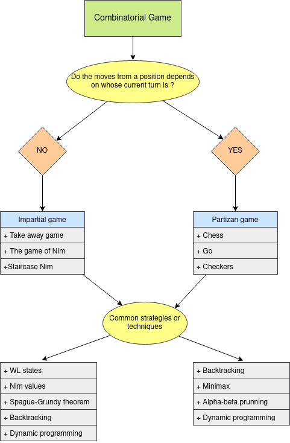
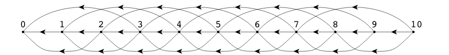

```{r setup, include=FALSE}
htmltools::tagList(rmarkdown::html_dependency_font_awesome())
```

> "Don’t Repeat Yourself"

<div class="topic">Introduction</div>

When we talk about game theory in competitive programming we mean combinational
game theory. In combinatorial game theory we study combinatorial games, these
are two-person games with perfect information and no change moves, and with
a win-or-lose outcome. We can define such games using:

- Set of possible positions
- Initial position
- Set of terminal positions
- Player that start the game
- Function that determines the possible moves from each position

If the function that determines the possible moves from each position is the
same for both players, then we have a **impartial game**, else we have
a **partizan game**. For each type (impartial and partizan) there are different strategies to solve them as we can see in the following diagram:

<div class="row text-center">

</div>

We will focus in study some of these strategies and techniques.

<div class="topic">WL states</div>

### A simple take-away game

**Problem:** There is a pile of $n$ chips and two players (player A and player B). They are alternating turns, in each turn a player removes one, two or three chips from the pile. The player that removes the last chip wins. If player A starts the game and both players play optimally, who will be the winner ?

In order to solve this problem we can use what is called **backward
induction**. This technique consists in analyzing a problem from the end back
to the begining.

Let:

- $L$: losing position for player A
- $R$: winning position for player A

We can define a function $f: \mathbb{N \cup \{0\}} \to \{L, R\}$ such that 
$f(x)$ indicates what is the result for player A if the game has a pile a $x$
chips.

From these definitions we have:

- $f(0) = L$
- $f(1) = W$
- $f(2) = W$
- $f(3) = W$
- $f(4) = L$
- $f(5) = W$
- $f(6) = W$
- $f(7) = W$
- $f(8) = L$
- $f(9) = W$
- $f(10) = W$
- $f(11) = W$
- $f(12) = L$

That is, if there is no chips, then player $A$ loses. If there is $1, 2$ or $3$ chips,
then player $A$ can take all the chips in a move and win. If there is $4$ chips
no matter how many chips player $A$ takes, because player $B$ can end the game
in the next turn. If there is $5, 6$ or $7$ chips, then player $A$ can left
just $4$ chips, then no matter how many chips player $B$ takes in its turn, in
the next turn player $A$ can take all the remaining chips. $\dots$

From these we notice that $f(x) = L$ iff $L \equiv 0 \bmod 4$. Then, we have
solved the problem.

The idea of defining a function that maps some states to $L, W$ is what is
called WL states. Moreover, we can generalize this idea with the following
property:

### Characteristic property

WL states are defined recursively by the following three statements:

1. All terminal positions are $L$ states.
2. From every $W$ state, there is at least one move to a $L$ state.
3. From every $L$ state, every move is to a $W$ state.

We can interpret these statements in this way:

1. If I am in a terminal state, then I have no available moves, so I am in
   a losing state.
2. If I can make that the other player starts its turn in a state where he will lose,
   then I am in a winning state.
3. If I am in a state where no matter what I do, in the next turn the other
   player have a winning strategy, then I am in a losing state.

Now, let's practice solving [UVA 10404 - Bachet's game](https://onlinejudge.org/index.php?option=com_onlinejudge&Itemid=8&page=show_problem&problem=1345).

It is basically a generalized version of 'A simple take-away game'. The problem is the same, we still have a pile of $n$ chips, but now the set of available moves (how many chips we can take) is variable.

We can use the characteristic property to solve the problem using backtracking
in this way:

```c++
#include <bits/stdc++.h>

using namespace std;

int n, m;
vector <int> take;

const int L = 0;
const int W = 1;

int rec (int x) {
  if (x == 0) { // terminal state
    return L;
  }
  int result = L; // suppose we are in a losing state
  for (int t: take) {
    if (t <= x and rec(x - t) == L) {
      // if there is a move to a losing state
      // then we are in a winning state
      result = W;
    }
  }
  return result;
}

int main () {
  int n, m;
  while (cin >> n >> m) {
    take.resize(m);
    for (int i = 0; i < m; i++) cin >> take[i];
    if (rec(n) == W) cout << "Stan wins" << '\n';
    else cout << "Ollie wins" << '\n';
  }
  return (0);
}
```

The solution is correct, but it takes too much time doing the same
computations, so we can memorize some results and improve the solution in this
way:

```c++
#include <bits/stdc++.h>

using namespace std;

int n, m;
vector <int> take;
vector <int> memo;

const int L = 0;
const int W = 1;
const int UNVISITED = 2;

int rec (int x) {
  if (x == 0) { // terminal state
    return L;
  }
  if (memo[x] != UNVISITED) { // we have already compute it
    return memo[x];
  }
  int result = L; // suppose we are in a losing state
  for (int t: take) {
    if (t <= x and rec(x - t) == L) {
      // if there is a move to a losing state
      // then we are in a winning state
      result = W;
    }
  }
  return memo[x] = result;
}

int main () {
  while (cin >> n >> m) {
    take.resize(m);
    memo.resize(n + 1, UNVISITED);
    for (int i = 0; i < m; i++) cin >> take[i];
    if (rec(n) == W) cout << "Stan wins" << '\n';
    else cout << "Ollie wins" << '\n';
    take.clear();
    memo.clear();
  }
  return (0);
}
```

We are now solving each case in $O(nm)$ which is enough to get Accepted
veredict.

<div class="topic">The game of Nim</div>

**Problem:** There are $n$ piles of stones $x_1, x_2, \dots, x_n$. There are two players
(player A and player B) that are alternating turns. In each turn a player
selects a pile (**only one**) and removes at least one chip from it. The winner
is the player who removes the last chip. If player A starts the game and both
players play optimally, who will be the winner ?

We can play this game in [this link](https://www.dotsphinx.com/games/nim/).

Now, in order to solve this problem first let's define what is $Nim-sum$.

**Def. Nim-sum:** The Nim-sum of two non-negative integers is their addition
without carry in base 2. That is, if we have:

$$a = \overline{a_na_{n-1} \dots a_1}_{(2)}$$
$$b = \overline{b_nb_{n-1} \dots b_1}_{(2)}$$

Filling with zeros as necessary so that $a$ and $b$ have the same number of
digits.

Let $c$ be the Nim-sum of $a$ and $b$, then $c_i = (a_i + b_i) \bmod 2$ and it
is written as $c = a \oplus b$.

That is, $a \oplus b$ is this in C++:

```c++
int c = a ^ b;
```

And $\oplus$ is called the xor operator.

This definition is important because we can use it to characterize the set of
winning states using the characteristic property. In fact, it is done in the
following theorem:

### Bouton's theorem

Let $\mathbb{L}$ be the set of losing states and $\mathbb{W}$ the set of
winning states. Then, the solution of the game of Nim with piles $x_1, x_2,
\dots, x_n$ is characterized in this way:

$$(x_1, x_2, \dots, x_n) \in \mathbb{L} \leftrightarrow \displaystyle\bigoplus_{1 \leq i \leq n} x_i = 0$$

**Proof:**

1. The only terminal position is $(0, 0, \dots, 0)$ and $0 \oplus 0 \oplus \dots \oplus 0 = 0$.
2. Let $(x_1, x_2, \dots, x_n) \in \mathbb{W}$, then $\displaystyle\bigoplus_{1 \leq i \leq n} x_i \not = 0$, so is we write all the numbers in binary representation in a matrix form, there exists a column $k$ (let's take the leftmost) such that the number of ones in this column is odd. So we can take stones from a pile that have a $1$ in this column. Moreover let $p = \overline{p_{n}p_{n-1}\dots p_{k} \dots p_1}_{(2)}$ be the number of stones taken from this pile, then we can form $p$ in such a way that $p_i = 0, \forall i \geq k$ and $\forall i < k, p_i$ can be $0$ or $1$, then we can form it in such a way that the Nim-sum of the new state would be 0. In other words, there is a losing state reachable from a winning state.
3. Let $(x_1, x_2, \dots, x_n) \in \mathbb{L}$. If we take the pile $k$ and
   take some stones such that $x_k$ reduces to $x_k' < x_k$, then the new state
   have Nim-sum different from zero (**You can prove it by contradiction**).


We can use the above theorem to solve [10165 - Stone Game](https://onlinejudge.org/index.php?option=com_onlinejudge&Itemid=8&page=show_problem&problem=1106).

The statement is basically the game of Nim. Then, this is a possible solution:

```c++
#include <bits/stdc++.h>

using namespace std;

int main () {
  int n;
  while (cin >> n, n != 0) {
    int nim_sum = 0;
    for (int i = 0; i < n; i++) {
      int x;
      cin >> x;
      nim_sum ^= x;
    }
    puts(nim_sum == 0 ? "No" : "Yes");
  }
  return (0);
}
```

<div class="topic">Grundy numbers</div>

We can express the characteristic property in a slighty different way. First,
let's define:

$$mex(state) = \min\{n \geq 0: n \not = mex(state') \quad \forall state' \text{ reachable
from } state \}$$

In other words, $mex(state)$ is the smallest non-negative integer not found
amoung the function $mex$ evaluated in states reachable from $state$.

The function $mex$ is known as the **Spragre-Grundy function** or as **minimum excludant** and its values as **grundy numbers**. And what is nice about this function is that $mex(state) = 0 \leftrightarrow states \text{ is a losing state}$.

So, all the problems that we could solve with the characteristic property can
now be solved using its grundy numbers. For example, for the first problem we
solved, 'A simple take-away game', the transitions can be seen in this way:

<div class="row text-center">


Image taken from [Game theory - Thomas S. Ferguson. Page 14](https://www.math.ucla.edu/~tom/Game_Theory/comb.pdf)
</div>

Now, we can compute its grundy numbers and we'll get:

- $mex(0) = 0$
- $mex(1) = 1$
- $mex(2) = 2$
- $mex(3) = 3$
- $mex(4) = 0$
- $mex(5) = 1$
- $mex(6) = 2$
- $mex(7) = 3$
- $mex(8) = 0$
- $mex(9) = 1$
- $mex(10) = 2$
- $mex(11) = 3$
- $mex(12) = 0$

Then, we get the same result: $n$ is a losing position $\leftrightarrow
n \equiv 0 \bmod 4$.

And we can even solve [UVA 10404 - Bachet's
game](https://onlinejudge.org/index.php?option=com_onlinejudge&Itemid=8&page=show_problem&problem=1345)
but now using the $mex$ function in this way:

```c++
#include <bits/stdc++.h>

using namespace std;

int n, m;
vector <int> take;
vector <int> memo;

const int UNVISITED = -1;

int grundy (int x) {
  if (x == 0) { // terminal state
    return 0; // mex 0
  }
  if (memo[x] != UNVISITED) { // we have already compute it
    return memo[x];
  }
  set <int> values;
  for (int t: take) {
    if (t <= x) {
      values.insert(grundy(x - t));
    }
  }
  int mex = 0;
  while (values.count(mex)) mex++;
  return memo[x] = mex;
}

int main () {
  while (cin >> n >> m) {
    take.resize(m);
    memo.resize(n + 1, UNVISITED);
    for (int i = 0; i < m; i++) cin >> take[i];
    if (grundy(n) != 0) cout << "Stan wins" << '\n';
    else cout << "Ollie wins" << '\n';
    take.clear();
    memo.clear();
  }
  return (0);
}
```

Now, we are solving each case in $O(nm)$ which is enough to get Accepted veredict.

But the importante of this new interpretation of the characteristic property
can be better seen in the next section.

<div class="topic">Sprague-Grundy theorem</div>

In process...

<div class="topic">Extra: About floating point numbers</div>


Recommended readings:

- [Game theory - Thomas S. Ferguson. Chapter 1-4](https://www.math.ucla.edu/~tom/Game_Theory/comb.pdf)
- [Algorithm Games - Topcoder](https://www.topcoder.com/community/competitive-programming/tutorials/algorithm-games/)
- [Game Theory For Competitive Programming](https://stepupanalytics.com/game-theory-for-competitive-programming/)

<div class="topic" id="contest">Contest</div>

You can find the contest [here](https://vjudge.net/contest/357719).

The solutions will be uploaded after the contest.

<p style="float: none; clear: both;"></p>

<!--
<div style="float: right;" class="pt-3">
  <a class="continue-link" href="./class-11.html" 
     data-toggle="tooltip" title="Divide and Conquer I">
  Next
  </a>
</div>
-->

<div class="pt-3">
  <a class="continue-link" href="./class-12.html"
     data-toggle="tooltip" title="Divide and Conquer II">
  Previous
  </a>
</div>

<script>
  $('#all-classes').collapse('show');
  $('#class-13').addClass('active');
  const cur_class = document.getElementById('class-13');
  cur_class.scrollIntoView({
    behavior: 'smooth',
    block: 'center'
  });
</script>
