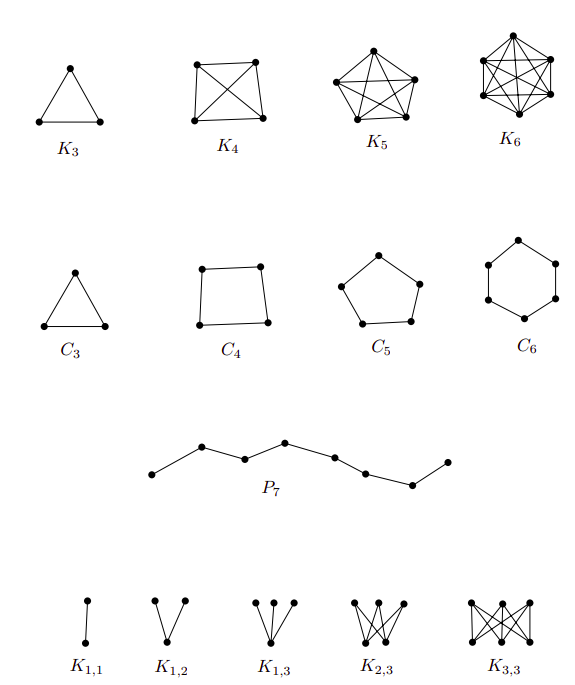
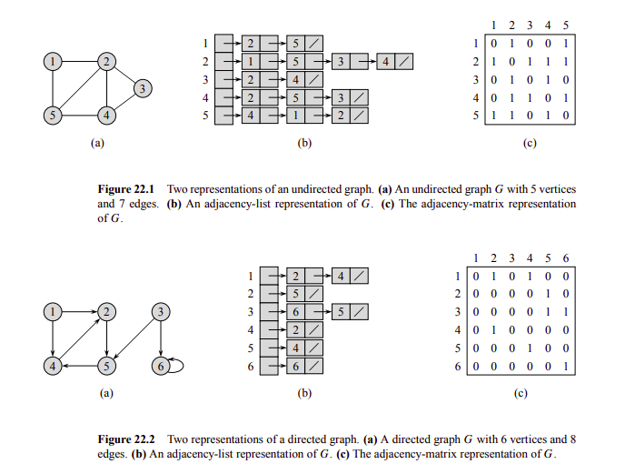
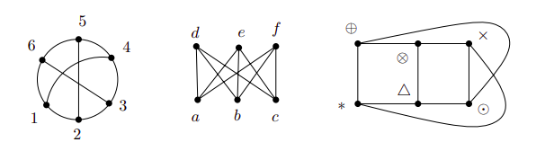
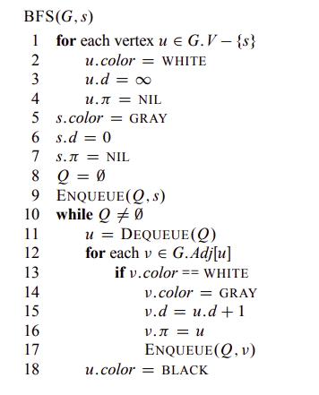
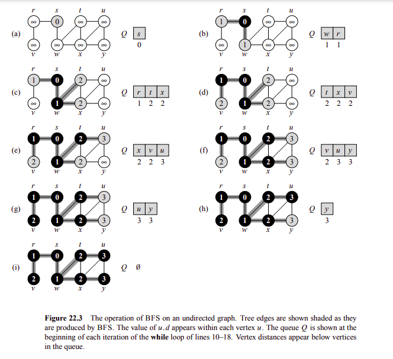
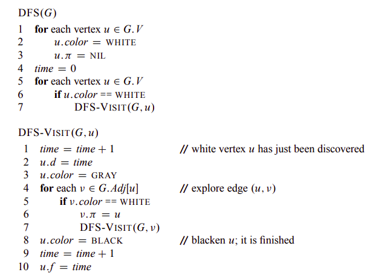
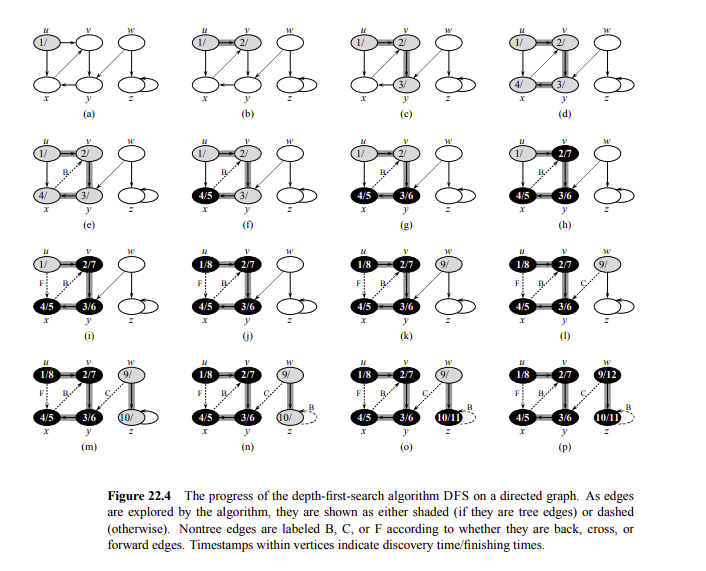

```{r setup, include=FALSE}
htmltools::tagList(rmarkdown::html_dependency_font_awesome())
```

> "One needs to do a serious amount of reading and writing, and not just thinking, in order to get anywhere serious in mathematics."

<div class="topic">Introduction</div>

Many situations in mathematics and computer science can be expresed by two things:

1. A set of points
2. Lines joining some pairs of points

And if we disregard the properties of the joins (length, shape, etc) and we only pay attention to which pairs are joined and which are not, then
we arrive at the mathematical notion of a graph. Formally, we have:

**Definition 1.** A graph $G$ is and ordered pair $(V, E)$, where $V$ is some set and $E$ is a set of 2-point subsets of $V$.
The elements of $V$ are called vertices of the graph $G$ and the elements of $E$ edges of $G$.

**Definition 2.** A directed graph $G$ is and ordered pair $(V, E)$, where $V$ is some set and $E$ is a set pairs of elements of $V$.

Now, we can express different situations using the definition of a graph and directed graph. For example.

* The statement "Descartes loves Sofia and Sofia loves Descartes" can be expresed as a graph 

  $G_1 = (V_1, E_1)$ where $V_1 = \{\text{Descartes}, \text{Sofia}\}$ and 
  $E_1 = \{\{\text{Descartes}, \text{Sofia}\}\}$

* Similarly, it can be expresed as a directed graph

  $G_2 = (V_2, E_2)$ where $V_2 = \{\text{Descartes}, \text{Sofia}\}$ and 
  $E_2 = \{(\text{Descartes}, \text{Sofia}), (\text{Sofia}, \text{Descartes})\}$

Here $E_{G}$ represents a relationship of love. In the same manner, we can define a graph to express some relationship between a set of elements.

**Observation 1.** If $(u, v) \in E_{G}$. It does not imply that $(v, u) \in E_{G}$

Now, we understand the definition of a graph. Next, we need to known some popular graphs.

* Complete graph $K_n$

$V = \{1, 2, \dots, n\}$

$E = V \times V \setminus \{\{u, u\}, u \in V\}$

* Cycle $C_n$

$V = \{1, 2, \dots, n\}$

$E = \{\{i, i + 1\}: i = 1, 2, \dots, n - 1\} \cup \{\{1, n\}\}$

* Path $P_n$

$V = \{0, 1, \dots, n\}$

$E = \{\{i - 1, i\}: i = 1, 2, \dots, n\}$


* Complete bipartite graph $K_{n, m}$

$V = \{u_1, \dots, u_n\} \cup \{v_1, \dots, v_m\}$

$E = \{\{u_i, v_j\}: i = 1, 2, \dots, n, j = 1, 2, \dots, m \}$


<div class="row text-center">


Images taken from [Invitation to Discrete Mathematics, pages 112, 113](https://www.amazon.com/-/es/Jiri-Matousek/dp/0198570422)
</div>

<div class="topic">Graph representation</div>

There are different ways how we can represent a graph $G = (V, E)$. Here we mention two:

1. Adjacency matrix

It is a matrix $A_G = (a_{ij})_{i,j=1}^n$ where

\[ a_{ij} =
  \begin{cases}
    1       & \quad \text{if } \{v_i, v_j\} \in E \\
    0  & \quad \text{otherwise}
  \end{cases}
\]

2. Adjacency list

It is a computational representation using a list for each vertex to save the adjacent element of each vertex.

<div class="row text-center">


Images taken from [Introduction to Algorithms - page 590](https://www.amazon.com/-/es/Thomas-H-Cormen/dp/0262033844)
</div>

Obviously, the representation to use depends on the problem (consider space complexity, time access complexity, etc).

Now, let's study an interesting advantage gained by using $A_G$.

**Definition 3.** Let $G = (V, E)$ be a graph. A path in $G$ is a sequence:

$$(v_0, e_1, v_1, \dots, e_t, v_t)$$

where $v_0, v_1, \dots, v_t$ are mutually distinct vertices of $G$ and $e_i = \{v_{i - 1}, v_i\} \in E(G): i = 1, 2, \dots, t$.
Here we say that we have a path from $v_0$ to $v_t$ of length $t$.

Similarly, we have:

**Definition 4.** Let $G = (V, E)$ be a graph. A cycle in $G$ is a sequence:

$$(v_0, e_1, v_1, \dots, e_{t-1}, v_{t-1}, e_t, v_0)$$

where $v_0, v_1, \dots, v_{t-1}$ are mutually distinct vertices of $G$, $e_i = \{v_{i - 1}, v_i\} \in E(G): i = 1, 2, \dots, t-1$ and
$e_t = \{v_{t-1}, v_0\} \in E(G)$. Here we say that we have a cycle of length $t$.


**Proposition 1.** Let $G = (V, E)$ be a graph with $V = \{v_1, v_2, \dots, v_n\}$. Let $A = A_{G}$ be its adjacency matrix.
Let $A^k$ denothe the $k$th power of $A$. Let $a_{ij}^{(k)}$ denote the element at position $(i, j)$ of $A^k$. Then, $a_{ij}^{(k)}$ 
is the number of walks of length exactly $k$ from vertex $v_i$ to vertex $v_j$ in the graph $G$.

**Proof:** Left to the reader (use induction).

<div class="topic">Distance in graphs</div>

**Definition 4.** A graph $G = (V, E)$ is connected if $\forall x, y \in V(G)$, $G$ contains a path from $x$ to $y$.

**Property 1.** The complement of a connected graph is connected.

**Proof.** Left to the reader.

**Definition 5.** Let $G = (V, E)$ be a connected graph. We define the distance of two vertices $v_1, v_2 \in V(G)$, denoted by $d_G(v_1, v_2)$,
as the length of the shortest path from $v_1$ to $v_2$ in $G$. Hence $d_G$ is a function, $d_G: V \times V \to \mathbb{R}$, and it is called the 
distance function or the metric of the graph $G$. It has the following properties:

i) $d_G(v, v) \geq 0$ and $d_G(v_1, v_2) = 0 \leftrightarrow v_1 = v_2$

ii) $d_G(v_1, v_2) = d_G(v_2, v_1) \, \forall v_1, v_2 \in V(G)$

iii) $d_G(v_1, v_2) \leq d_G(v_1, v_3) + d_G(v_3, v_2) \, \forall v_1, v_2, v_3 \in V(G)$

Now, using definition 5 and proposition 1, we have the following corollaly.

**Corollary 1.** $\forall v_i, v_j \in V(G), d_G(v_i, v_j) = \min(k \geq 0: a_{ij}^{(k)} \not = 0)$

This corollaly is really important. First, notice how we have reduced the computation of $d_G$ to matrix multiplication. One application
of this idea is the following:

**Property 2.** A graph $G$ contains a triangle (i.e. a $K_3$) $\leftrightarrow \exists \, i, j \mid a_{ij}^{(1)} \not = 0 \land a_{ij}^{(2)} \not = 0$.


<div class="topic">Graph isomorphism</div>

What if two graph have the same structure, but its vertices are named differently? We need a way to express this notion. That is the reason of
the following definition.

**Definition 6.** Two graphs $G = (V, E) \land G' = (V', E')$ are called isomorphic if a bijection $f: V \to V'$ exists such that

$$\{x, y\} \in E \leftrightarrow \{f(x), f(y)\} \in E'$$

holds for all $x, y \in V, x \not = y$. Such an $f$ is called an isomorphism of the graphs $G$ and $G'$. The fact that $G$ and $G'$ are
isomorphic is written as $G \cong G'$.


**Observation 2.** The relation $\cong$ ("to be isomorphic") is a class of equivalence on any set of graphs.

<div class="row text-center">


Examples of isomorphic graphs taken from [Invitation to Discrete Mathematics, page 114](https://www.amazon.com/-/es/Jiri-Matousek/dp/0198570422)
</div>

Determining if two graphs are isomorphic is not at all an easy problem. It is suspected that no efficient algorithm exists, but for small 
graphs a brute force approach can be enough. In order to do it just check all the $n!$ possible bijections. The implementation of this idea
is simple using the following property:

**Property 3.** Two graphs $G, G'$ are isomorphic if and only if a permutation matrix $P$ exists such that $A_G' = P A_G P^T$.

A matrix $P$ is called a permutation matrix if its entries are 0 and 1 and each row and column contain preciely one 1.

**Proof.** Left to the reader.

<div class="topic">Graph score</div>

**Definition 7.** Let $G$ be a graph and $v \in G(V)$. The degree of vertex $v$ is defines as $deg_G(v) = |e \in E(V), v \in e|$.

Now, we can formulate this famous statement:

**Proposition 2.** For each graph $G = (V, E)$ we have:

$$\displaystyle\sum_{v \in V} deg_{G}(v) = 2 |E|$$

**Proof.** Exercise for the reader.

From the aboive proposition, we get a direct corollary.

**Corollary 2 (Handshake lemma).** The number of odd-degree vertices is even in any graph.

There are a lot of important properties about the topic. For instance.

**Property 4.** Let $G$ be a graph in which all vertices have degree at least $d$. Then, $G$ contains a path of length $d$.

**Proof.** Excercise for the reader.

**Property 5.** Let $G$ be a graph with all vertices at least 3. Then $G$ contains a cycle.

**Proof.** Excercise for the reader :D.

**Definition 8.** Let the vertices of a graph $G$ be $v_1, v_2, \dots, v_n$. The sequence

$$(deg_G(v_1), deg_G(v_2), \dots, deg_G(v_n))$$

is called the degree sequence of the graph $G$, or a score of $G$.

Next, a valid question to ask is: How can we known if a sequence of integers is a graph score or not?

Fortunately, we can answer the above question with the following theorem.

**Theorem 1 (Score theorem).** Let $D = (d_1, d_2, \dots, d_n)$ de a sequence of natural numbers, $n > 1$. Suppose that

$$d_1 \leq d_2 \leq \dots \leq d_n$$

Let $D'$ denote the sequence $(d_1', d_2', \dots, d_{n-1}')$, where

\[ d'_i =
  \begin{cases}
  d_i & \quad \text{for } i < n - d_n\\
  d_i - 1 & \quad \text{for } i \geq n - d_n
  \end{cases}
\]

Then $D$ is a graph score if and only if $D'$ is a graph score.

**Proof.** Read [Invitation to Discrete Mathematics, section 4.3](https://www.amazon.com/-/es/Jiri-Matousek/dp/0198570422).
 
<div class="topic">Trees</div>

There is a kind of graphs where problems become easier: trees. Let's study them!

**Definition 9.** A tree is a connected graph containing no cycle.

This is the definition we will be using, but there are different ways how we can define them.

**Theorem 2 (Tree characterization).** The following conditions are all equivalent for a graph $G = (V, E):$

(i) G is a tree.

(ii) (Path uniqueness) $\forall x, y \in V(G),$ there exists exactly one path from $x$ to $y$.

(iii) (Minimal connected graph) $G$ is connected and deleting any of its edges gives rise to a disconnected graph.

(iv) (Maximal graph without cycles) $G$ contains no cycle and any graph arising from $G$ by adding and edge already contains a cycle

(v) (Euler's formula) $G$ is connected and $|V| = |E| + 1$.

**Proof.** Left as exercise to the reader.

**Definition 10.** Let $v$ be a vertex of a graph $G = (V, E)$ with $deg_G(v) = 1$. Then $v$ is a end-vertex of $G$ (a.k.a. leaf).

Some important properties of a graph are the following:

**Property 6.** Let $G$ be a tree and $v$ a leaf of $G$, then $G - v$ is a tree.

**Proof.** Left to the reader as exercise.

**Property 7.** Let $G$ be a tree containing a vertex of degree $k$, then $G$ has at least $k$ end-vertices.

**Proof.** Left to the reader as exercise.

Finally, we define the following two concepts:

**Definition 11.** A graph $G$ where each component is a tree is called a forest.

This definition will be useful in next sections.

**Definition 12.** A graph $G$ is called bipartite if the set $V(G)$ can be divided into two disjoint sets $V_1$ and $V_2$ in such
a way that each edge of $G$ connects a vertex from $V_1$ to a vertex of $V_2$.

**Observation 3.** A tree is bipartite.

Moreover, we have this simple but useful property.

**Property 8.** A graph is bipartite is and only if it contains no cycle of odd length.

**Proof.** Left to the reader as exercise.

Now, we need a computational way to explore our graph and to find properties of them. So, let's study two simple and powerful algorithms: BFS and DFS.

<div class="topic">BFS</div>

The idea is to start with a vertex an put it to a queue, then add its adjacents, then the adjacents of its adjacents, and so on.

The algorithm maintains the following properties for each vertex:

* Color: It describes the state of the vertex.
  - WHITE: Not visited.
  - BLACK: Visited.
  - GRAY: Processing.

* d: The distance from the center.
* $\pi$: The predecesor of the vertex (the one who put it to the queue).

<div class="row text-center">


BFS pseudocode. Taken from [Introduction to Algorithms - page 595](https://www.amazon.com/-/es/Thomas-H-Cormen/dp/0262033844)
</div>


<div class="row text-center">


Example operation of BFS. Taken from [Introduction to Algorithms - page 596](https://www.amazon.com/-/es/Thomas-H-Cormen/dp/0262033844)
</div>

**Observation 4.** It we start a BFS from vertex $s$ in a graph $G$. Then, it holds that for any edge $(u, v) \in E(V), d_G(s, u) \leq d_G(s, v) + 1$


**Observation 5.** Suppose that we run a BFS on a graph $G$ from vertex $s$ and the order of vertices added to the queue are $(v_1, v_2, \dots, v_n)$. Then it holds:

$$d_G(s, v_1) \leq d_G(s, v_2) \leq \dots \leq d_G(s, v_n)$$

$$d_G(s, v_{i+1}) - d_G(s, v_i) \leq 1: i = 1, 2, 3, \dots, n - 1$$

**Observation 6.** If we run a BFS on a graph $G$ from vertex $s$, we can build a graph $G_{\pi} = (V, E')$ where $E' = \{(u.\pi, u): \, \forall u \in V(G), u \not = s\}$.
$G_{\pi}$ is known as the BFS tree and it represent the shortest path distance from $s$ to the other vertices.

**Observation 7.** The running time of BFS algorithm is $O(|V| + |E|)$ and its space complexity is $O(|V|)$.

Here we present some common applications of BFS algorithm:

1. Find the connected components. Just run a BFS from every vertex if it has not been visited.

2. Check if a graph is bipartite. After the execution of the algorithm, there must not be an edge $(u, v)$ such that $u.color = v.color$.

3. Find the shortest path from to vertex $u$ to vertex $v$. Run a BFS from $u$, then find the unique path from $u$ to $v$ in the BFS tree.

4. Find the shortest cycle. Run a BFS from each vertex $u \in V(G)$, then if during the exploration you find a vertex $v$ such that $v.color = GRAY$, then you have the shortest cycle from vertex $u$. 

<div class="topic">DFS</div>

The idea is to start with a vertex and explore recursively by each of its neighbors.

The algorithm maintains the following properties for each vertex:

* Color: It describes the state of the vertex.
  - WHITE: Not visited.
  - BLACK: Visited.
  - GRAY: Processing.

* d: The discovered time of the vertex.
* f: The finished time of exploration of the vertex.
* $\pi$: The predecesor of the vertex (the one who put it to the queue).

<div class="row text-center">


DFS pseudocode. Taken from [Introduction to Algorithms - page 604](https://www.amazon.com/-/es/Thomas-H-Cormen/dp/0262033844)
</div>


<div class="row text-center">


Example operation of DFS. Taken from [Introduction to Algorithms - page 605](https://www.amazon.com/-/es/Thomas-H-Cormen/dp/0262033844)
</div>

Moreover, if we run DFS algorithm on a graph $G$, we can build a graph $G_{\pi} = (V, E')$ where $E' = \{(u.\pi, u): \, \forall u \in V(G), u.\pi \not = NIL\}$.
$G_{\pi}$ is known as the DFS tree or DFS forest if $G$ has more than one component.

**Observation 8.** The running time of DFS algorithm is $O(|V| + |E|)$ and its space complexity is $O(|V|)$.

**Definition 13.** A rooted tree is a pair $(T, r)$, where $T$ is a tree and $r \in V(T)$ is a distinguished vertex of $T$ called the root.

**IMPORTANT.** When you have a problem with trees, the very first idea is to root it.

**Definition 14.** If we run a DFS on a rooted tree $(T, r)$, we get a directed tree $T_{\pi}$. Then, for two vertices $x, y \in V(T)$, we say that $x$ is an ancestor of $y$ and $y$ is a descendant of $x$.

**Observation 9.** If we run DFS algorithm in a graph $G = (V, E)$ for any two vertices $u, v$, exactly one of the following three conditions holds:

(i) $[u.d, u.f]$ and $[v.d, v.f]$ are disjoint, and neither $u$ nor $v$ is a descendant of the other in $G_{\pi}$.

(ii) $[u.d, u.f]$ is entirely contained  in $[v.d, v.f]$, and $u$ is a descendant of $v$ in $G_{\pi}$.

(iii) $[v.d, v.f]$ is entirely contained  in $[u.d, u.f]$, and $v$ is a descendant of $u$ in $G_{\pi}$.

Furthermore, we can use the DFS algorithm to classify the edges of a graph $G$. We have:

1. **Tree edges** are the edges in $G.{\pi}$.

2. **Back edges** are the edges $(u, v) \in E(G)$ that connect $u$ to an **ancestor** of $v$ in $G_{\pi}$.

3. **Forward edges** are the edges $(u, v) \in E(G)$ that connect $u$ to a **descendant** of $v$ in $G_{\pi}$.

4. **Cross edges** are the edges $(u, v) \in E(G)$ that connect different components in $G_{\pi}$.

**Observation 10.** If we run DFS algorithm in a tree $G = (V, E)$, then every edge is a tree edge or a back edge.

The common applications of DFS algorithm will be study in another class in more depth.

<div class="topic">Diameter of a tree</div>

Definition of the diameter
Algorithm to find the diameter in greedy way

Problem: Number of diameters of a tree

Center definition

Statement: The center lies on diameter

Problem solution

<div class="topic">Isomorphism of trees</div>

Definition of rooted trees and the kind of isomorphism

Canonical representation of a tree

Usage

Recommended readings:

- [Introduction to Algorithms - Sections 22.1, 22.2, 22.3](https://www.amazon.com/-/es/Thomas-H-Cormen/dp/0262033844)
- [Invitation to Discrete Mathematics, chapter 4 and and sections 5.1, 5.2](https://www.amazon.com/-/es/Jiri-Matousek/dp/0198570422)
- [Algorithms Live! - Episode 1 - Trees and Diameters](https://www.youtube.com/watch?v=2PFl93WM_ao)
- [E-maxx Breadth-first search](https://cp-algorithms.com/graph/breadth-first-search.html)
- [E-maxx Depth First Search](https://cp-algorithms.com/graph/depth-first-search.html)
- [The () Canonical Form of a Tree](http://webhome.cs.uvic.ca/~wendym/courses/582/16/notes/582_12_tree_can_form.pdf)

<p style="float: none; clear: both;"></p>

<!--
<div style="float: right;" class="pt-3">
  <a class="continue-link" href="./class-15.html" 
     data-toggle="tooltip" title="Contest II">
  Next
  </a>
</div>
-->

<div class="pt-3">
  <a class="continue-link" href="./class-16.html"
     data-toggle="tooltip" title="Contest UTEC-UNI-UPC II">
  Previous
  </a>
</div>

<script>
  $('#all-classes').collapse('show');
  $('#class-17').addClass('active');
  const cur_class = document.getElementById('class-17');
  cur_class.scrollIntoView({
    behavior: 'smooth',
    block: 'center'
  });
</script>
