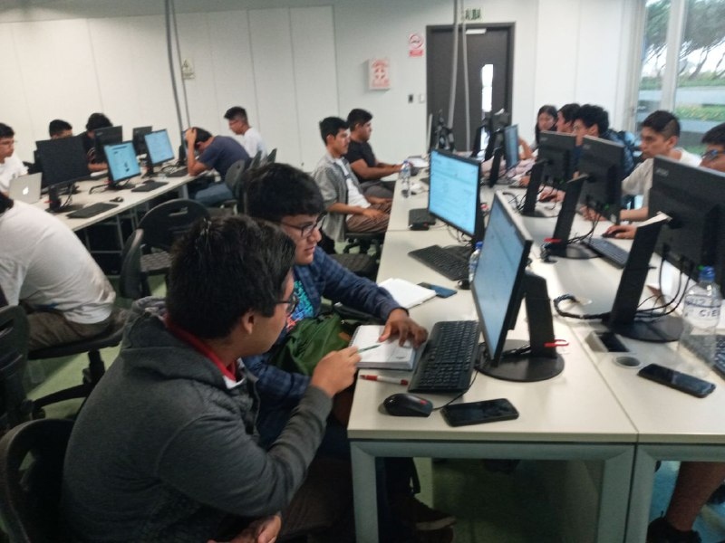
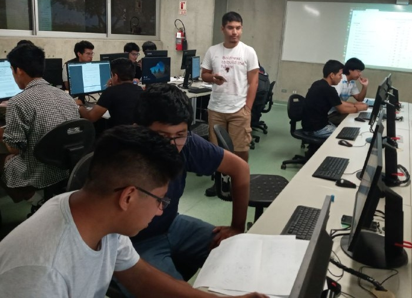

### **First class**

### **Contest UTEC-UNI I**

#### In the beggining of the contest

<ol class="carousel-indicators">
  <li data-target="#carousel1" data-slide-to="0" class="active"></li>
  <li data-target="#carousel1" data-slide-to="1"></li>
  <li data-target="#carousel1" data-slide-to="2"></li>
  <li data-target="#carousel1" data-slide-to="3"></li>
  <li data-target="#carousel1" data-slide-to="4"></li>
  <li data-target="#carousel1" data-slide-to="5"></li>
  <li data-target="#carousel1" data-slide-to="6"></li>
  <li data-target="#carousel1" data-slide-to="7"></li>
  <li data-target="#carousel1" data-slide-to="8"></li>

</ol>

  

  
  

  

  
  

  

  
  

  

  
  

  

  
  

  

  
  

  

  
  

  

  
  

  

  
  

  
<a href="#carousel1" class="left carousel-control" data-slide="prev">
  
</a>

<a href="#carousel1" class="right carousel-control" data-slide="next">
  
</a>

#### In the middle of the contest

<ol class="carousel-indicators">
  <li data-target="#carousel2" data-slide-to="0" class="active"></li>
  <li data-target="#carousel2" data-slide-to="1"></li>
  <li data-target="#carousel2" data-slide-to="2"></li>
  <li data-target="#carousel2" data-slide-to="3"></li>
  <li data-target="#carousel2" data-slide-to="4"></li>
  <li data-target="#carousel2" data-slide-to="5"></li>

</ol>

  

  
  

  

  
  

  

  
  

  

  
  

  

  
  

  

  
  

  
<a href="#carousel2" class="left carousel-control" data-slide="prev">
  
</a>

<a href="#carousel2" class="right carousel-control" data-slide="next">
  
</a>

#### Last minutes of the contest

<ol class="carousel-indicators">
  <li data-target="#carousel3" data-slide-to="0" class="active"></li>
  <li data-target="#carousel3" data-slide-to="1"></li>
  <li data-target="#carousel3" data-slide-to="2"></li>
  <li data-target="#carousel3" data-slide-to="3"></li>
  <li data-target="#carousel3" data-slide-to="4"></li>
  <li data-target="#carousel3" data-slide-to="5"></li>
  <li data-target="#carousel3" data-slide-to="6"></li>
  <li data-target="#carousel3" data-slide-to="7"></li>
  <li data-target="#carousel3" data-slide-to="8"></li>

</ol>

  

  
  

  

  
  

  

  
  

  

  
  

  

  
  

  

  
  

  

  
  

  

  
  

  

  
  

  
<a href="#carousel3" class="left carousel-control" data-slide="prev">
  
</a>

<a href="#carousel3" class="right carousel-control" data-slide="next">
  
</a>

#### After the contest

<ol class="carousel-indicators">
  <li data-target="#carousel4" data-slide-to="0" class="active"></li>
  <li data-target="#carousel4" data-slide-to="1"></li>
  <li data-target="#carousel4" data-slide-to="2"></li>
  <li data-target="#carousel4" data-slide-to="3"></li>
  <li data-target="#carousel4" data-slide-to="4"></li>
  <li data-target="#carousel4" data-slide-to="5"></li>
  <li data-target="#carousel4" data-slide-to="6"></li>

</ol>

  

  
  

  

  
  

  

  
  

  

  
  

  

  
  

  

  
  

  

  
  

  
<a href="#carousel4" class="left carousel-control" data-slide="prev">
  
</a>

<a href="#carousel4" class="right carousel-control" data-slide="next">
  
</a>

